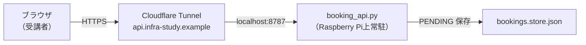
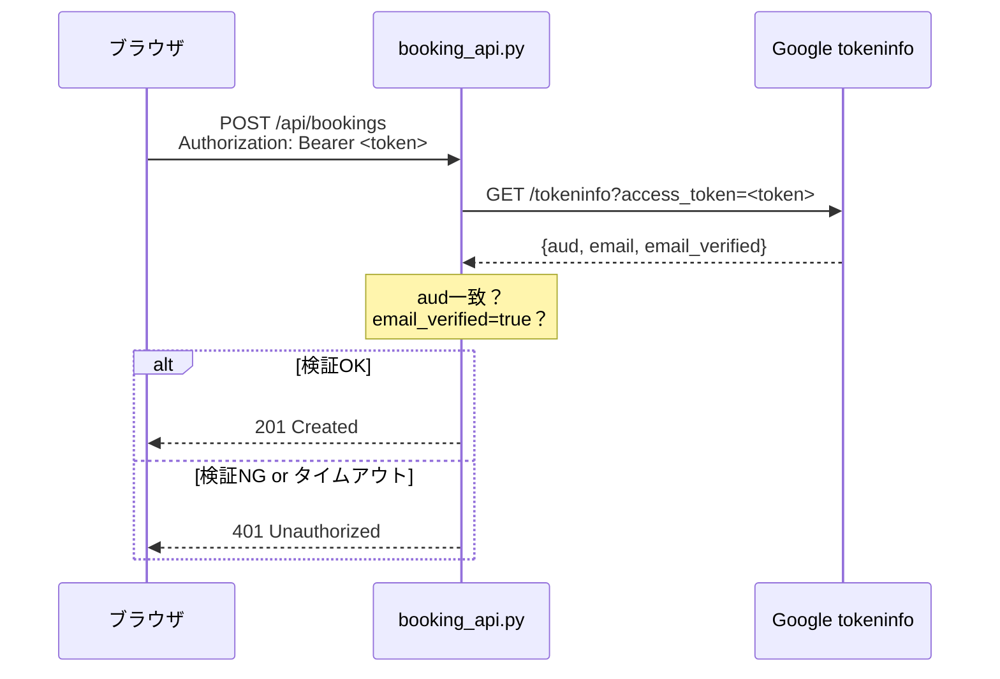

自宅ラボの予約APIに、「誰でも好きなメールアドレスを名乗って予約できる」穴が空いていた話です。

穴の原因は1行です。クライアントが自己申告する `X-User: you@example.com` というヘッダを、サーバーが何も確認せずそのまま信じていた。気づいたのは、開発中に「Cloudflare Access のヘッダが入っている想定だけど、本当に予約APIまで届いているか確認してほしい」と言われたことがきっかけでした。

調査してみると、Cloudflare Access の設定は別サービスには入っていたけれど、予約APIには設定されていなかった。しかも問題はそこだけではなく、API自体が「クライアントが言うメールを無条件で受け入れる」作りになっていました。

:::message
この記事は予約APIの実装レベルの認証ミスを扱います。Cloudflare Access や nginx のヘッダ偽装問題とは別件です（詳細は後述「扱わない範囲」参照）。
:::

## 全体構成

infra-study.org というインフラ学習サービスで、受講者が実機環境（自宅ラボのVM）を時間帯ごとに予約できる仕組みを作っています。

予約フローはこうです。



APIサーバーは Python の標準ライブラリだけで実装した `booking_api.py` で、Raspberry Pi 上で動いています。Cloudflare Tunnel 経由でのみ到達でき、LAN直接アクセスはできない構成です。

この記事では、受講者が操作する予約画面を `status.html`、予約リクエストを受けるAPIサーバーを `booking_api.py` と呼びます。構成全体の記事は別途まとめる予定ですが、この記事では「予約画面 → 予約API → 予約ファイル保存」の流れだけ分かれば読めるようにしています。

## 問題：ヘッダを書き換えれば誰でも他人になれた

問題が発覚する前の `_user()` 関数はこうなっていました（再現した擬似コード）。

```python
def _user(self):
    # クライアントが送ってきたヘッダをそのまま信じる
    return self.headers.get("X-User")
```

`X-User: victim@example.com` というヘッダをリクエストに含めれば、それだけで `victim@example.com` として扱われます。予約も、他人の予約のキャンセルも、自由にできる状態でした。

実際に確認すると `curl` で以下のように叩けばよいだけです。

```bash
curl -X POST https://api.infra-study.example/api/bookings \
  -H "Content-Type: application/json" \
  -H "X-User: victim@example.com" \
  -d '{"start":"2026-07-01T10:00:00","end":"2026-07-01T12:00:00"}'
```

これが通っていました。

:::message alert
`X-User` などの任意ヘッダは、HTTPリクエストを送れる人なら誰でも任意の値を書き込めます。「ヘッダで誰かを名乗る」ことには何の制限もありません。「信頼できるプロキシが付与したヘッダだけを受け入れる」設計が必要です。
:::

## なぜそうなっていたか

もともとの設計では「Cloudflare Access を通じて認証済みユーザーの情報が転送される」想定がありました。Cloudflare Access は、認証を通過したリクエストに対して自動的にヘッダを付与する機能があります。

しかし実際に Cloudflare ダッシュボードを確認すると、Access のアプリケーションポリシーは別サービス（実機接続用の管理画面サブドメイン）にのみ設定されており、予約APIのサブドメインには**設定されていませんでした**。

設計意図と実装のあいだで状態が乖離しており、「あのヘッダは入っているはずだ」という思い込みが確認を遅らせた形です。

## 扱わない範囲

この記事は「予約APIの自己申告ヘッダ問題」にスコープを限定します。

リバースプロキシ層でのヘッダ偽装（nginx が LAN に露出しており、Cloudflare Access が付与するヘッダを外部から直接送り込める問題）は別のインシデントです。構造が似ているように見えますが、問題が起きているレイヤー（プロキシ設定 vs. APIの実装）も対策（IP制限 vs. トークン検証）も異なります。

## 対策：サーバー側でトークンを検証する

検討した選択肢は3つありました。

| 案 | 内容 | 判断 |
|---|---|---|
| A | Cloudflare Access を api にも追加 | 受講者にGoogle認証+ワンタイムOTPの二重ログインが発生するためUX悪化・不採用 |
| B | access\_token をサーバー側で検証 | ログインUX変更なし・stdlib完結・**現実的な暫定対応として採用** |
| C | ID Token（JWT）方式に作り直し | 変更範囲最大・依存追加・**認証専用としては本筋だが今回は見送り** |

案Bを採用した理由は、フロントエンド（`status.html`）では既に Google ログインが実装されており、ブラウザ側で `access_token` を取得済みだったためです。この `access_token` をそのままAPIに渡してサーバー側で検証すれば、受講者の操作は何も変わりません。

:::message
Google公式では、サーバー側での本人確認には ID Token（JWT）の検証を案内しています。`access_token` は本来アクセス権限（スコープ）を表すものであり、認証専用のトークンではありません。今回の access\_token 検証は「既存実装を大きく変えずに `X-User` 廃止を最速で達成する」ための現実的な暫定対応であり、認証方式として理想形というわけではない点を明記しておきます。
:::

### 検証の仕組み

Google の tokeninfo エンドポイントを使います。

```
GET https://oauth2.googleapis.com/tokeninfo?access_token=<token>
```

レスポンスに含まれる情報で、以下の3点を確認します。

1. `aud`（audience）が自分のクライアントIDと一致するか
2. `email_verified` が `true` か
3. `email` が存在するか



### フェイルクローズの徹底

tokeninfo への照会が失敗した場合（ネットワーク障害・タイムアウト・Google 側の一時障害など）の挙動を「401 を返す」に統一しました。

「照会できないなら通してしまう」（フェイルオープン）は選びません。なりすましを許すよりも、一時的に予約できない状態のほうが安全側です。タイムアウトは 2.5 秒に設定しています。

```python
def verify_google_token(token: str) -> str | None:
    """access_token を Google tokeninfo で検証し、確認済みメールを返す。
    aud 不一致・email 未確認・照会失敗はすべて None（フェイルクローズ）。"""
    if not token:
        return None
    # キャッシュ確認（TTL=5分）
    now = time.monotonic()
    with _token_cache_lock:
        cached = _token_cache.get(token)
        if cached and cached[1] > now:
            return cached[0]
    # tokeninfo 照会
    url = TOKENINFO_URL + "?access_token=" + urllib.parse.quote(token)
    try:
        with urllib.request.urlopen(url, timeout=TOKEN_TIMEOUT) as r:
            info = json.load(r)
    except (urllib.error.URLError, OSError, json.JSONDecodeError, TimeoutError):
        return None  # フェイルクローズ
    if info.get("aud") != GOOGLE_CLIENT_ID:
        return None
    if str(info.get("email_verified", "")).lower() != "true":
        return None
    email = info.get("email")
    if not email:
        return None
    # キャッシュ登録
    with _token_cache_lock:
        _token_cache[token] = (email, now + TOKEN_CACHE_TTL)
    return email
```

実際に動く `booking_api.py` から抜粋・整形しています。stdlib だけで書いており、依存ライブラリの追加はありません。

### _user() の書き換えと X-User の廃止

`_user()` を `Authorization: Bearer` ヘッダだけを読むように書き換えます。`X-User` は完全に捨てます。

変更前（擬似コード）:

```python
def _user(self):
    return self.headers.get("X-User")  # 自己申告をそのまま返す
```

変更後:

```python
def _user(self):
    auth = self.headers.get("Authorization", "")
    if not auth.startswith("Bearer "):
        return None
    return verify_google_token(auth[len("Bearer "):].strip())
```

`Authorization` ヘッダがない・形式が違う・トークン検証が通らない、のどれかひとつでも `None` を返し、呼び出し側は 401 を返します。

### フロントエンドの変更

`status.html` では Google ログイン時に `access_token` をグローバル変数 `googleAccessToken` として保持しており、API 呼び出し時のヘッダ生成を `X-User` から `Authorization: Bearer` に切り替えます。

```javascript
// 変更前（擬似コード）
function authHeaders(email) {
  return { "Content-Type": "application/json", "X-User": email };
}

// 変更後
function authHeaders() {
  return {
    "Content-Type": "application/json",
    "Authorization": `Bearer ${googleAccessToken}`
  };
}
```

受講者側からは、ログインフロー（Google 認証 1 回のみ）は何も変わりません。

## キャッシュについて

`access_token` の検証結果を 5 分間キャッシュしています。同じトークンで短期間に複数リクエストが来るたびに Google の tokeninfo を叩くのは無駄なうえ、レイテンシの影響を受けやすくなるためです。

`access_token` の有効期限は一般に短時間であり、今回の 5 分キャッシュはそれより十分短い想定です。ログアウト後の「使い回し」も 5 分で切れます。

:::message
キャッシュはメモリ上（プロセス内辞書）です。`booking_api.py` を再起動するとキャッシュはクリアされます。再起動直後は全リクエストで tokeninfo 照会が発生しますが、実害はありません。
:::

## 実証：なりすまし 3 パターンが全て 401

デプロイ後、なりすましのパターンを実際に試しました。

:::details 検証ログ（クリックで展開）

```text
# パターン1: 旧 X-User ヘッダのみ（Authorization なし）
$ curl -s -o /dev/null -w "%{http_code}" \
  -X GET https://api.infra-study.example/api/my-bookings \
  -H "X-User: other@example.com"
401

# パターン2: Authorization ヘッダ自体がない
$ curl -s -o /dev/null -w "%{http_code}" \
  -X GET https://api.infra-study.example/api/my-bookings
401

# パターン3: 偽の Bearer トークン
$ curl -s -o /dev/null -w "%{http_code}" \
  -X GET https://api.infra-study.example/api/my-bookings \
  -H "Authorization: Bearer fake_token_here"
401
```

全て 401 になることを確認。続いて実ブラウザで Google ログイン → 予約 → キャンセルの一連の操作が正常に通ることも確認しました。

:::

`bookings.store.json` に記録された予約レコードには、`verify_google_token()` が返した**検証済みメール**が入っています。クライアントの自己申告ではなく、Google の tokeninfo で検証した値です。

## 補足：Cloudflare Access を追加しなかった理由

案Aとして「予約APIのサブドメインにも Cloudflare Access のポリシーを追加する」を検討しましたが、採用しませんでした。

理由は UX です。今回のポリシー・セッション設定では、Cloudflare Access はアクセスのたびに認証フロー（Google ログイン + ワンタイム OTP メール）を経由します（挙動はアプリケーションごとのポリシー設定に依存し、Cloudflare Access 全般の仕様というわけではありません）。予約ページ（`status.html`）はすでに Google ログインを要求しており、ここにさらに Cloudflare の認証レイヤーが重なると、受講者は「2 回ログインする」という状況になります。

今回は「既存の Google ログイン 1 回で認証を完結させる」を優先し、その access_token をサーバーが直接検証する案Bを選びました。

## 補足：本筋は ID Token（JWT）方式への移行

現行の access_token 検証（案B）は、あくまで「`X-User` 廃止を最速で達成する」ための現実的な暫定対応です。認証専用の方式としては、Google 公式が案内する ID Token（OpenID Connect の JWT）の検証がスジがいい正攻法にあたります。

access_token 検証には制約もあります。tokeninfo エンドポイントへの HTTP 照会が毎回（キャッシュ切れ後）必要なため Google のサービス可用性に依存しますし、access_token 自体は本来アクセス権限（スコープ）を表すものであり、「このサービスの認証専用トークン」ではありません。一方 ID Token は email・email_verified を含む JWT をサーバーが公開鍵で署名検証するだけで完結し、Google への外部依存もありません。

受講者が数十人規模に増えた場合や、Guacamole 側の JWT 検証（既存資産あり）と統一したい場合には、この ID Token 方式への移行を本筋の対応として実施する予定です。変更範囲は大きくなりますが、既存の実装資産を流用できる見込みがあるため、優先度が上がった時点で着手します。

今回は「既存実装を壊さず、なりすまし穴を最速で塞ぐ」ことを優先した暫定対応である、という位置づけです。

## まとめ：「誰が言ったか」ではなく「誰であるかを検証したか」

カスタム HTTP ヘッダはリクエストを送れる人なら誰でも書き換えられます。「Cloudflare が付けたはずだから信じる」は、「付いているかどうか」を確認していないと成立しません。

今回の教訓を一言で言うと、**ユーザー識別はクライアントの自己申告ではなく、サーバーが第三者（今回は Google）に照会して確認した値だけを使う**、ということです。

```text
クライアントが言うメール（X-User）
    ↓ 信頼しない
Bearerトークンを受け取る
    ↓ Google tokeninfo で照会
aud一致・email_verified=true を確認
    ↓ 検証済みのメールだけを信頼
予約レコードに記録する
```

stdlib のみ・依存ゼロで実装でき、フロントエンドのログインUXも変わりません。認証方式としての本筋は ID Token（JWT）検証ですが、「なりすまし穴を最速で塞ぐ」現実的な暫定対応として、現時点ではこの方式を選んでいます。

---

## ご紹介

感想をもとにコンテンツを改善しながら、いずれは実機サーバーに触れる演習も用意していく予定です。

まずは Linux の基礎を読んでみてください。

**Linux の基礎:** [infra-study.org/part1-chapter01](https://infra-study.org/part1-chapter01)

**感想フォーム:** [感想フォーム（Tally）](https://tally.so/r/eqvX8l)

---

この記事は、infra-study「Part 0 / Chapter 0」のおまけとして、実装中に出会ったセキュリティ判断を記録したものです。

よかったら見てみてください。

X（@taro3_01）で更新を告知しています。フォローすると次回の通知が届きます。

@[card](https://x.com/taro3_01)
