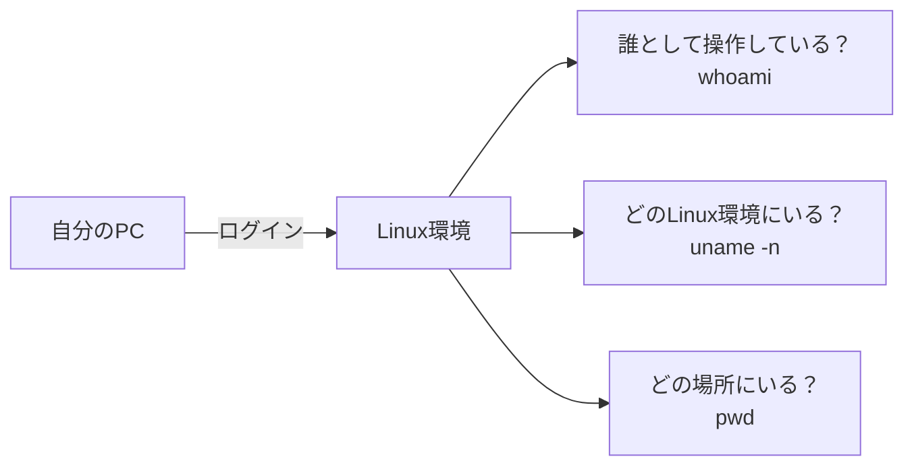
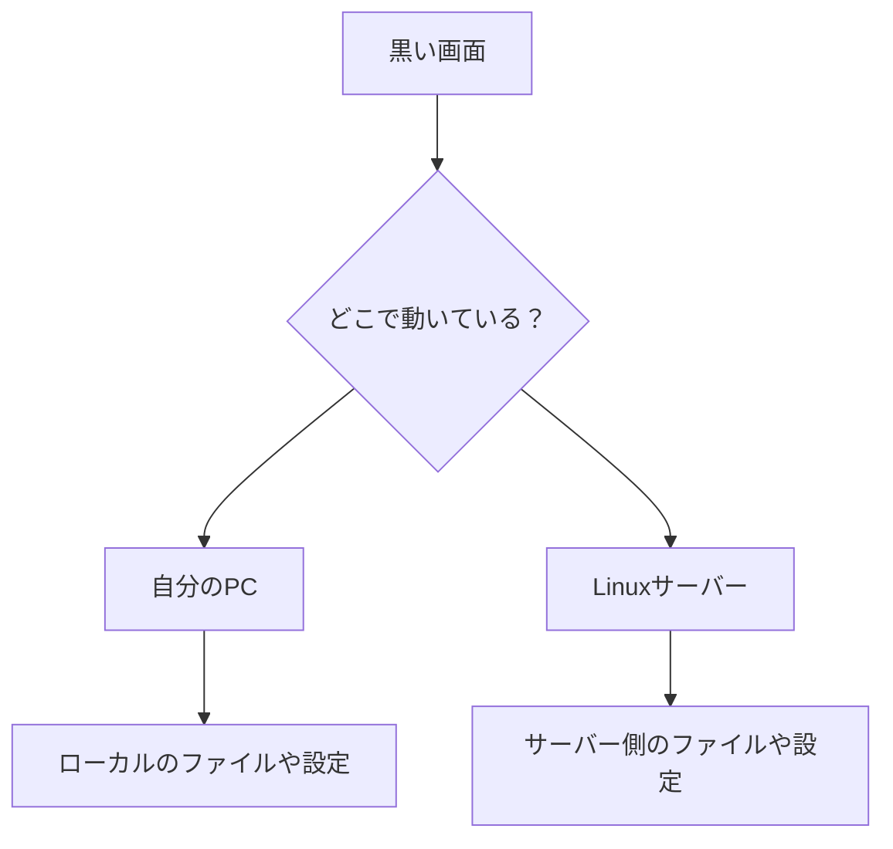

この記事では、Linuxの基礎として、気軽に操作するための最初の感覚をつかむことを目的にしています。

難しいコマンドをたくさん覚える前に、まずは  
「自分は誰として操作しているのか」  
「どのLinux環境を操作しているのか」  
「いまどの場所にいるのか」  
を確認できるようにしていきます。

基礎、という言葉は少し退屈に聞こえることがあります。

「まずは基礎から」  
「基礎が大事」  
「基礎を固めよう」

もちろん、その通りです。  
でも、言われる側からすると、少しだけ重たいですよね。

なぜなら基礎は、まだ何に役立つのか見えていない段階で渡されることが多いからです。

コマンドを覚える。  
ディレクトリを移動する。  
ファイルを見る。  
ログインする。

どれも大事そうではある。  
でも最初のうちは、それが何につながっているのかが見えにくい。

この記事では、Linuxやサーバーを学ぶ入口として、  
「いま自分はどこにいるのか」を少しだけ見つめなおしてみます。

## Linuxの黒い画面は、「いまいる場所」を見るための窓

Linuxやサーバーの学習というと、黒い画面にコマンドを打つイメージがあります。

最初は、あの画面だけで少し緊張しますよね。

間違えたら壊しそう。  
英語ばかりで読みにくい。  
何が起きているのかわからない。

でも、Linuxの黒い画面は本来、怖がらせるためのものではありません。

むしろ、今いる場所を確かめるための窓です。

たとえば、こんなコマンドがあります。

```bash
whoami
uname -n
pwd
```

それぞれ、ざっくり言うとこうです。

```text
whoami   -> 自分は誰として操作しているか
uname -n -> どのLinux環境を操作しているか
pwd      -> どの場所にいるか
```

どれも派手ではありません。  
でも、かなり大事です。

なぜなら、Linuxでは**同じコマンドでも、どこで、誰として実行しているかで意味が変わる**からです。

## まず「現在地」を見る

イメージとしては、こんな感じです。



黒い画面に向かうと、つい「次に何を打つか」を考えたくなります。

でもその前に、少しだけ立ち止まってみる。

いま自分は、どの環境にいるのか。  
誰として操作しているのか。  
どのディレクトリにいるのか。

そこを確かめるだけで、作業の見え方が少し変わります。

Linuxの学習は、コマンドをたくさん覚えることから始まるように見えます。  
でも実際には、「状況を確認する力」がかなり大事です。

## `pwd` は、迷子になったときに足元を見るコマンド

少しだけうんちくを入れると、`pwd` は `print working directory` の略です。

直訳すると、「作業中のディレクトリを表示する」くらいの意味です。

この “working directory” という考え方は、最初は地味です。  
でも、あとからかなり効いてきます。

ファイルを作る。  
移動する。  
削除する。  
設定を見る。  
ログを見る。

その全部が、「いま自分がどこにいるか」と関係しています。

たとえば、同じようにファイルを作ったつもりでも、今いるディレクトリが違えば、ファイルは別の場所にできます。

```bash
pwd
touch memo.txt
```

このとき `memo.txt` が作られるのは、いま `pwd` で表示された場所です。

当たり前に聞こえるかもしれません。  
でも、この当たり前が見えていないと、あとでけっこう迷います。

「ファイルを作ったはずなのに見つからない」  
「説明通りにやったのに結果が違う」  
「さっきと同じコマンドなのに、動きが違う」

そういうとき、原因はコマンドの暗記不足ではなく、  
**自分がいる場所を見失っていること**だったりします。

だから `pwd` は、ただの確認コマンドというより、  
迷子になったときに足元を見るためのコマンド、くらいに思っておくとちょうどいいです。

## `whoami` は、自分の立場を見るコマンド

`whoami` も、かなり素朴なコマンドです。

```bash
whoami
```

意味はそのまま、「私は誰？」です。

Linuxでは、誰として操作しているかによって、できることが変わります。

あるユーザーでは読めるファイルが、別のユーザーでは読めない。  
あるユーザーでは実行できる操作が、別のユーザーでは止められる。

これは意地悪ではなく、システムを守るための仕組みです。

最初は「権限」という言葉だけ聞くと難しく感じます。  
でも入口はシンプルです。

まず、自分が誰として操作しているのかを見る。

そこからで大丈夫です。

## `uname -n` は、いま操作しているLinux環境を見るコマンド

もうひとつ、`uname -n` も便利です。

```bash
uname -n
```

これは、いま操作しているLinux環境の名前を表示します。

`uname` は、システムの情報を表示するためのコマンドです。  
その中で `-n` は、ネットワーク上で使われるノード名を表示します。

少し難しく聞こえるかもしれませんが、最初は  
「いま自分がどのLinux環境を操作しているのかを見るコマンド」  
くらいに思っておけば大丈夫です。

自分のPCで作業しているつもりなのか。  
それとも、ログイン先のLinuxサーバーで作業しているのか。

この違いは、慣れないうちは意外と見失いやすいです。

特に、SSHなどで別の環境にログインしていると、見た目は同じ黒い画面でも、実際には別のコンピューターを操作しています。



画面の見た目が似ているからこそ、  
「いま、どのLinux環境にいるんだっけ？」を確認する習慣が大事になります。

## コマンドを覚える前に、状況を確かめる

初心者のころは、どうしても「正しいコマンド」を探したくなります。

何を打てばいいですか。  
この場合の答えは何ですか。  
この手順で合っていますか。

もちろん、それも必要です。

でも実際の作業では、コマンドそのものより先に見るものがあります。

それは、状況です。

今、自分はローカルPCにいるのか。  
それとも、Linuxサーバーにログインしているのか。  
一般ユーザーなのか。  
管理者に近い権限を持っているのか。  
どのディレクトリで作業しているのか。

この確認を飛ばすと、あとで混乱します。

逆にいうと、ここを確認できるだけで、Linuxの学習はかなり落ち着きます。

わからなくなったら、まず見る。

```bash
whoami
uname -n
pwd
```

これだけでも、黒い画面は少し怖くなくなります。

## 基礎は、退屈な前提ではない

基礎というと、先に我慢して覚えるもの、という感じがします。

でも本当は、基礎はあとから効いてくる「見方」だと思っています。

`whoami` で自分を見る。  
`uname -n` で相手を見る。  
`pwd` で場所を見る。

この3つだけでも、Linuxの黒い画面は少し変わって見えます。

ただ文字を打つ場所ではなく、  
「いま自分がどこに立っているのか」を確かめる場所になる。

その感覚があるだけで、Linuxの学習は少し楽になります。

基礎を見つめなおす、というのは、  
昔の知識をもう一度暗記し直すことではありません。

見えていなかった足元を、もう一度ちゃんと見ることです。

もしよかったら、infra-study の Part 1 Chapter 1 もあわせて見てもらえるとうれしいです。  
実際に手を動かしながら、この「現在地を確かめる感覚」を試せるようにしています。

## これからについて

感想をもとにコンテンツを改善しながら、いずれは実機サーバーに触れる演習も用意していく予定です。

まずは Linux の基礎を読んでみてください。

**Linux の基礎:** https://infra-study.org/part1-chapter01  
**感想フォーム:** https://tally.so/r/eqvX8l

X（@taro3_01）で更新を告知しています。フォローすると次回の通知が届きます。

@[card](https://x.com/taro3_01)

---

_この記事は、infra-study「Part 1 / Chapter 1」に対応した補足記事です。_
