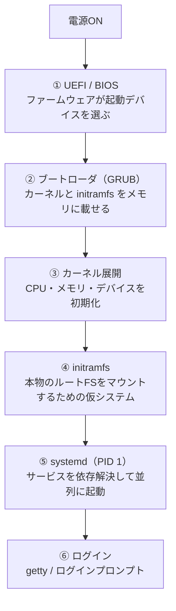

この記事では、Linuxサーバーの電源ボタンを押してから、ログインプロンプトが出るまでに **裏で何が・どの順番で動いているか** を、1本の地図として通して見ます。

各段の細かい仕組みは、このあとシリーズで1段ずつ掘り下げます。今回は「全体のどこに何があるか」をつかむための **親記事** です。

サーバーを再起動して、ログインプロンプトが出るまでの十数秒。あの間、画面には何も出ないか、流れるログが一瞬見えるだけです。

「電源を入れたら、いつのまにかLinuxが立ち上がっている」——多くの人にとって、ここはブラックボックスのままになりがちです。

普段Linuxを触っているインフラエンジニアでも、「で、電源を入れた直後、最初に動くのは誰？」「カーネルはいつ・誰が読み込むの？」と聞かれると、意外と言葉に詰まります。

## なぜ「起動の流れ」を知っておくと得なのか

起動が正常なときは、確かに中身を知らなくても困りません。

困るのは、止まったときです。

- 再起動したらログインプロンプトまで来ず、途中で `(initramfs)` というプロンプトで止まった
- `emergency mode` に落ちて、原因がどの段階なのか分からない
- ディスクを増設・交換したあと、起動しなくなった

こういうとき、「起動は大きく分けて何段あって、いま止まっているのはどの段か」が頭に入っていると、切り分けが一気に速くなります。逆に地図がないと、どこを調べればいいのか分からず手が止まります。

この記事のゴールは、その **地図を1枚持ち帰ってもらうこと** です。

## 全体像：起動は大きく6段ある

電源ONからログインまでを、ざっくり6つの段に分けて並べます。



ポイントは、**「あとの段ほど、前の段にお膳立てしてもらって動く」** ことです。ファームウェアがブートローダを呼び、ブートローダがカーネルを載せ、カーネルが仮の小さなシステム（initramfs）を立て、そこで本物のディスクをマウントして、ようやく `systemd` が主役になります。

バトンが順に渡されていくリレーだと思ってください。どこか1人がバトンを落とすと、そこから先には進めません。

以下、各段を1段ずつ、**最低限の「正体」と「確認コマンド」だけ** 見ていきます。深掘りは各段の詳細記事に譲ります。

## ① UEFI / BIOS — 最初に動く「土台」

電源を入れて最初に動くのは、Linuxでもブートローダでもありません。マザーボード上のファームウェア（UEFI、古い言い方ならBIOS）です。

これは「どのディスク（やネットワーク）から起動するか」を選び、その先頭にあるブートローダに制御を渡す役です。OSの外側にいる、いちばん下の土台にあたります。

自分のマシンがUEFIで起動しているかは、Linuxから後追いで確認できます。

```bash
ls /sys/firmware/efi >/dev/null 2>&1 && echo "UEFI" || echo "Legacy BIOS"
```

```text
UEFI
```

`/sys/firmware/efi` というディレクトリが存在すれば、そのマシンはUEFIで起動しています。存在しなければ旧来のBIOS（レガシー）起動です。

:::message
ここで分かるのは「いまどちらで起動したか」だけです。なぜ起動デバイスの順序がこう決まるのか、Secure Boot とは何か、といった話は別の山場なので、UEFIの詳細記事で扱います。
:::

> **▶ 詳細記事（近日公開）**：UEFIはどうやって起動ディスクを選ぶのか / `efibootmgr` で見る起動エントリ

## ② ブートローダ（GRUB） — カーネルをメモリに載せる橋渡し

ファームウェアから制御を受け取るのがブートローダです。Linuxではほぼ `GRUB` が使われます。

GRUBの仕事は、ざっくり言うと **「カーネル本体（`vmlinuz`）と initramfs をディスクから読み出して、メモリに載せ、カーネルに制御を渡す」** ことです。起動時に複数のカーネルを選べるメニューを出しているのも、これです。

どのカーネルと initramfs を読もうとしているかは、設定ファイルの該当行で確認できます。

```bash
grep -E 'vmlinuz|initrd' /boot/grub/grub.cfg | head -n 2
```

```text
        linux   /boot/vmlinuz-6.1.0-21-amd64 root=/dev/mapper/vg-root ro quiet
        initrd  /boot/initrd.img-6.1.0-21-amd64
```

`linux` 行が読み込むカーネル、`initrd` 行が次の段で使う initramfs です。`root=` で「本物のルートはここだよ」とカーネルに伝えているのも見えます。

:::message alert
`grub.cfg` は自動生成されるファイルで、原則として手で直接編集しません。設定変更は `/etc/default/grub` と `update-grub`（環境により `grub-mkconfig`）経由で行います。理由は詳細記事で扱います。
:::

> **▶ 詳細記事（近日公開）**：GRUBは結局、起動の何をやっているのか / なぜ `grub.cfg` を直接いじらないのか

## ③ カーネル展開 — ハードウェアを初期化する

GRUBがメモリに載せたカーネルが、いよいよ動き始めます。

カーネルはここで、CPUやメモリの初期化、各種デバイスの認識といった「ハードウェアと話す土台づくり」を行います。この段のログは、起動後に `dmesg` で振り返れます。

```bash
dmesg | head -n 3
```

```text
[    0.000000] Linux version 6.1.0-21-amd64 ...
[    0.000000] Command line: BOOT_IMAGE=/boot/vmlinuz-6.1.0-21-amd64 root=/dev/mapper/vg-root ro quiet
[    0.004000] KERNEL supported cpus:
```

先頭の `[    0.000000]` は、カーネルが動き出してからの経過秒数です。つまりここが、Linuxにとっての「時刻ゼロ」です。`Command line:` には、さきほどGRUBが渡したパラメータがそのまま入っています。

ただ、この時点ではまだ **本物のルートファイルシステム（あなたのファイルが入ったディスク）はマウントされていません**。それを準備するのが、次の段です。

> **▶ 詳細記事（近日公開）**：カーネルの「時刻ゼロ」から `dmesg` を読む

## ④ initramfs — 本物のルートをマウントするための仮システム

ここがこのシリーズで一番「意外と知らない」段です。

カーネルが動いても、すぐに本物のディスクをマウントできるとは限りません。なぜなら、ルートファイルシステムが **LVMの上にあったり、暗号化されていたり、特殊なディスクコントローラの先にあったり** すると、それをマウントするためのドライバや道具立てが必要だからです。そしてその道具立て自体が、まだマウントできていない本物のディスクの中にある——という鶏卵問題が起きます。

これを解くために、GRUBがカーネルと一緒に載せておいたのが `initramfs`（イニットラムエフエス）です。メモリ上に展開される、使い捨ての小さなLinuxシステムだとイメージしてください。

その中身は、実際に開いて覗けます。

```bash
lsinitramfs /boot/initrd.img-$(uname -r) | grep -E 'lvm|systemd' | head -n 3
```

```text
usr/lib/systemd/systemd
usr/sbin/lvm
scripts/local-top/lvm2
```

`lvm` や `systemd` といった、本物のディスクをマウントするのに必要な道具が、最初からこの仮システムに同梱されているのが分かります。initramfs はこれらを使って本物のルートをマウントし、役目を終えると主役のバトンを `systemd` に渡します。

起動が `(initramfs)` というプロンプトで止まるのは、まさにこの段で本物のルートをマウントできなかったときです。地図があれば、「ディスクかLVMか、その手前を疑えばいい」と当たりがつきます。

> **▶ 詳細記事（近日公開）**：カーネルがあるのに、なぜ initramfs が要るのか（鶏卵問題の正体）

## ⑤ systemd（PID 1） — サービスを並列に立ち上げる司令塔

本物のルートがマウントされると、最初のプロセスとして `systemd` が起動します。プロセスID（PID）はいちばん最初の「1」番です。すべてのプロセスの先祖にあたります。

```bash
ps -p 1 -o pid,comm
```

```text
    PID COMMAND
      1 systemd
```

`systemd` の仕事は、ネットワーク、ログ、SSH、各種サービスを **依存関係を解いて、できるものから並列に** 立ち上げることです。「Aが終わってからB」ではなく「同時に立てられるものは同時に」進めるので、起動が速くなります。

どのサービスにどれだけ時間がかかったかは、可視化できます。

```bash
systemd-analyze blame | head -n 3
```

```text
3.214s NetworkManager-wait-online.service
1.087s dpkg-db-backup.service
 642ms snapd.service
```

起動が遅いとき、犯人をこの一覧で名指しできます。「なんとなく遅い」が「このサービスが3秒食っている」に変わります。

> **▶ 詳細記事（近日公開）**：systemd は PID 1 で最初に何をしているのか / target と依存解決

## ⑥ ログイン — getty とプロンプト

最後に、`systemd` が `getty` というサービスを立ち上げ、コンソールに見慣れたログインプロンプトを表示します。SSHで入る場合は、並行して立ち上がっている `sshd` が受け口になります。

ここまで来て、ようやく私たちが「Linuxが起動した」と認識する画面にたどり着きます。リレーのアンカーがゴールテープを切った瞬間です。

## この記事で扱わないこと

この記事は地図なので、各段は「正体」と「確認コマンド1つ」までに絞りました。次の話題は、それぞれの詳細記事で扱います。

- Secure Boot / 起動エントリの仕組み（① の詳細）
- GRUBの設定変更フローと多段ブート（② の詳細）
- カーネルパラメータの読み方（③ の詳細）
- initramfs の鶏卵問題と `(initramfs)` プロンプトからの復旧（④ の詳細）
- target / unit / 依存解決の実際（⑤ の詳細）

また、組み込みLinuxやAndroidのように `systemd` を使わない構成、コンテナ内の起動などは、この地図の対象外です。あくまで一般的なサーバーLinux（systemd採用ディストリビューション）を前提にしています。

## 実機での確認ログ

この記事のコマンドと出力は、ホームラボのサーバーVM（Debian系・UEFI起動・LVMルート）で確認しています。識別に不要な情報（ホスト名・ユーザー名・IP）は伏せています。

:::details 実機の出力（クリックで展開）

```text
# 起動方式
$ ls /sys/firmware/efi >/dev/null 2>&1 && echo UEFI || echo BIOS
UEFI

# PID 1 は systemd
$ ps -p 1 -o pid,comm
    PID COMMAND
      1 systemd

# initramfs に LVM とミドルが同梱されている
$ lsinitramfs /boot/initrd.img-$(uname -r) | grep -E 'sbin/lvm|lib/systemd/systemd$' | head
usr/sbin/lvm
usr/lib/systemd/systemd

# 起動所要時間の内訳
$ systemd-analyze
Startup finished in 4.512s (firmware) + 2.100s (loader) + 1.800s (kernel) + 6.330s (userspace) = 14.74s
```

`systemd-analyze` の1行に、この記事の6段がほぼそのまま出ているのが分かります（firmware = ①、loader = ②、kernel = ③④、userspace = ⑤⑥）。

:::

## まとめ：起動は「バトンリレー」、止まった段が分かれば切り分けは速い

電源ONからログインまでは、独立した魔法ではなく、6人がバトンを渡していくリレーです。

```text
電源ON
  ↓ ① UEFI/BIOS（起動デバイスを選ぶ）
  ↓ ② GRUB（カーネルとinitramfsを載せる）
  ↓ ③ カーネル（ハードウェア初期化）
  ↓ ④ initramfs（本物のルートをマウント）
  ↓ ⑤ systemd（サービスを並列起動）
  ↓ ⑥ ログイン（getty / sshd）
稼働
```

この6段の地図が頭にあれば、起動が途中で止まったときも「いまどの段で詰まっているか」から逆算できます。`(initramfs)` で止まれば④の手前、`emergency mode` なら⑤、というふうに。

次回からは、この各段を1つずつ、実機で手を動かしながら掘り下げていきます。まずは一番のヤマ場、**「カーネルがあるのに、なぜ initramfs が要るのか」** から始める予定です。

## 参考

- [The Linux Documentation Project: The Linux Boot Process](https://tldp.org/HOWTO/Bootdisk-HOWTO/x192.html)
- [freedesktop.org: systemd(1)](https://www.freedesktop.org/software/systemd/man/systemd.html)
- [Linux manual page: dmesg(1)](https://man7.org/linux/man-pages/man1/dmesg.1.html)
- [Linux manual page: bootup(7)](https://man7.org/linux/man-pages/man7/bootup.7.html)

---

## ご紹介

自分は、自宅に物理サーバーを置いて、インフラを学べる場所を作っています。

教材は登録なしで無料で読めます。実機のサーバーに接続する演習は構築中で、まだ全章には対応していません。

**全章インデックス:** [infra-study.org/curriculum](https://infra-study.org/curriculum)

**感想フォーム:** [感想フォーム（Tally）](https://tally.so/r/eqvX8l)

---

X（@taro3_01）で更新を告知しています。フォローすると次回の通知が届きます。

@[card](https://x.com/taro3_01)
