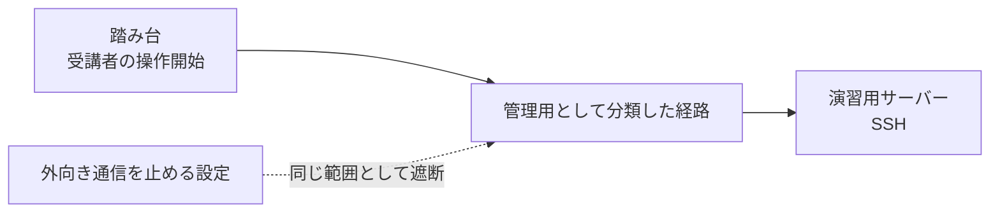

あるLinuxサーバーの外向き通信を全部止めたら、**止めるつもりのなかったSSHまで切れていました**。

厄介だったのは、その事実に気づいたのが、遮断の確認をすべて終えたあとだったことです。設定を入れた状態と外した状態を比べる対照実験もやりましたし、結果を自動で判定する仕組みも6本書きました。全部成功しています。

念のため、と最後に普通の操作を1つ試して、そこで初めて止まりました。

*「遮断の確認は全部通ったのに、なぜ入口で止まるんだろう」*

外へ出さないサーバーを作りたい、という要件自体は珍しくないと思います。ただ、そのあと何を確認するかで、こういう穴が空きます。自分が確認していたのは「**止めたい通信が止まったか**」だけで、「**通るべき通信が通り続けているか**」を誰も見ていませんでした。

環境だけ先に書いておきます。Linuxを学ぶための演習環境を運用していて、受講者はまず踏み台のサーバーに入り、そこから演習用のサーバーへSSHで移動します。今回いじったのは、その演習用サーバーへパッケージを配る役目の1台です。外へ出したくない理由は、配るものを自分の管理下に閉じたかったのと、受講者がその機械で管理者権限を取れる場面があるからでした。中から設定を消せては困るので、通信を止める設定はサーバーの中ではなく、その外側——仮想化基盤の側に置いています。

**この記事で分かること**

- 通信遮断の確認で、拒否される通信だけを見てはいけない理由
- 必要な通信を、利用者の実際の操作から洗い出す確認方法
- 自動判定や対照データそのものを疑うための見方

## この記事で扱わない範囲

先に断っておくと、この記事は通信制御製品の設定方法の話ではありません。ファイアウォールの文法も、環境ごとのルール例も出てきません。正しい設定値は環境によって変わるので、書いても役に立たないからです。

扱うのは設定したあとの話——何をどう確認するか、それだけです。特に「止めたい通信が止まること」と「通るべき通信が通り続けること」を対にするところに絞ります。

これは良し悪しの話ではなく、自分が片方だけ確認して失敗した話です。

## 確認は、かなり念入りにやったつもりだった

実際に適用する前に、設定ありと設定なしを切り替えながら動きを比べました。設定を外せば外へ出られ、入れれば出られない。そこまでは確認したつもりでした。

それだけでは不安だったので、管理用の接続が切れないことも見ています。受講者が使う別系統の通信路についても調べ、最終的に5つの条件を並べて結果を残しました。さらに、自動で合否を見る判定を6本書き、こちらもすべて緑です。

ここまで揃うと、塞ぎたいところだけ塞げたと考えてしまうのも、自然だったと思っています。

では、条件を並べて確認し、自動判定まで通したのに、いったい何が抜けていたのでしょうか。

答えは少し後に回して、まずは受講者と同じ操作をしたときの様子から見ていきます。

## 受講者と同じ操作をしたら、最初のSSHで止まった

仕上げに、受講者役のアカウントを使い、踏み台から演習用サーバーへ普通に入ってみました。教材では一番最初に行う操作なので、特別な試験というより、いつもの動作確認に近いものです。

```bash
ssh <user>@<training-host>
```

```text
ssh: connect to host <training-host> port 22: Connection timed out
```

返ってきたのは認証エラーではなく、接続そのもののタイムアウトでした。鍵やユーザー設定を見るより前に、通信経路のほうを疑いたくなる出力です。

*「これ、認証以前に届いていないのでは……？」*

何度か同じ操作を繰り返しましたが、結果は変わりません。教材の第一手順がこのSSHなので、この時点で受講者は1行目から先へ進めません。

## 「遮断できた」が、そのまま落とし穴になっていた

経路を追っていくと、原因そのものは複雑ではありませんでした。踏み台から演習用サーバーへ向かうSSHが、管理用として分類していたネットワークを通る作りになっていたんです。

ここで、並べておいた条件を見直します。その中に「配布役から管理ネットワーク宛は遮断された」という項目があり、自分はこれを問題なく成功として記録していました。ところが、その「管理ネットワーク宛」の中には、教材で使うSSHの道まで入っていました。

——守りたい通信だけを塞いだのではなく、必要な道まで一緒に塞いでいたわけです。



少し厄介なのは、確認をしていなかったわけではないところです。自分も、設計を見てくれた人も、事前に作った確認表も、そこから起こした自動判定も、この問題には気づきませんでした。

共通していたのは、落ちてほしい通信が落ちるかという方向を中心に見ていたことです。残したい通信が本当に残っているかは、同じ細かさで確認していませんでした。

原因を確かめるため、設定を外して、まったく同じSSHをもう一度実行します。操作は変えず、通信制御の有無だけを変えて比べました。

```bash
ssh <user>@<training-host>
```

```text
<user>@<training-host>:~$
```

今度は普通にプロンプトまで戻ってきました。失敗した操作と同じ条件で成功側も確認できたので、通信制御と症状の関係がここではっきりします。

## ところが、もう一つ妙なことが見つかった

これで原因は分かったと思ったのですが、設定を外した状態を見ていて別のことに気づきました。通信制御を外したのに、このサーバーは相変わらず外部へ出られません。

では、最初に「設定で外向き通信を塞げた」と判断した結果は、いったい何だったのでしょう。

外への経路そのものがあるのかを見るため、デフォルトルートだけを表示しました。通信制御より前の段階で、そもそも外へ向かう道が存在しているかを確かめるためです。

```bash
ip route show default
```

```text
（何も出力されない）
```

何も返ってきません。つまり、このサーバーには最初から外部へ向かうデフォルトルートが設定されていなかったことになります。

ここで、「設定を入れたら外へ出られなかった」という結果の見え方が変わりました。設定が効いたから出られなかったのではなく、**設定がなくても元から出られなかった**わけです。対照実験らしい形にはしていましたが、比較したい差そのものが最初から存在していませんでした。

:::message alert
通信制御を変更するときは、作業に使っている接続とは別の復旧経路を先に確保します。この記事は特定環境の変更手順ではなく、確認項目の作り方だけを扱っています。
:::

## さらに、壊したはずのデータも壊れていなかった

同じ日に作った自動判定では、別の小さな落とし穴にも引っかかりました。その中に「わざと壊したデータがきちんと拒否されるか」を見る判定を入れていたのですが、最初の実行では想定していた拒否が起きません。

調べてみると、壊したつもりの1文字が空行に当たっていて、元データから1バイトも変わっていませんでした。こちらも対照を用意したつもりで、実際には同じものを2つ並べていたわけです。

*「壊したつもりで、何も壊していなかった」*

こういうときは、検査を始める前に、元データと改変後のデータが本当に違うかを確認できます。`cmp` の終了コードまで表示すれば、差の有無をその場ではっきり分けられます。

```bash
cmp -s original.data altered.data; echo $?
```

```text
0
```

`0` なら2つのファイルは同じなので、この状態ではまだ何も壊せていません。拒否されるかを調べても、そもそも拒否されるための材料が用意できていない状態です。

改変する位置を直したあと、まったく同じコマンドでもう一度確認しました。

```bash
cmp -s original.data altered.data; echo $?
```

```text
1
```

今度は `1` が返り、元データと改変後のデータに差があることを確認できました。ここまで確かめて、ようやく「壊したデータが拒否されるか」という次の検査へ進めます。

## 判定を増やせば解決する話ではなかった

今回の件で少し怖かったのは、自動判定の数が足りなかったことではありません。すべてが同じ方向を向いていれば、判定を倍に増やしても同じ見落としが残ります。

これは良し悪しではなく、自動判定へ渡した問いの作り方の問題だと思っています。自動化は用意した問いには答えてくれますが、用意し忘れた問いまでは代わりに作ってくれません。

今回なら、「落ちるべき通信」と「残るべき通信」を最初から別の条件として持たせます。そのうえで設定ありと設定なしを比べ、設定によって本当に差が生まれたかまで見る形が合っていました。

外向き通信についても、まず元の状態で通信が成立するかを確かめておく必要がありました。デフォルトルートがないなら、遮断設定を入れる前から同じ結果になってしまうからです。

データ改変の検査も同じです。拒否されたかを見る前に、本当にデータを壊せたかを確認する。1文字変えたという操作ではなく、1バイト以上の差ができたという結果を見るほうが確実でした。

## まとめ

条件を並べて確認し、自動判定が全部緑でも、それだけでは安心できないことが分かりました。確認項目そのものが同じ思い込みから作られていれば、きれいに全部通ってしまいます。

塞げたことだけを合格にせず、残すべき道が残っていることと、対照そのものが成立していることまで、同じ重さで確かめる——という結論になりました。

---

## ご紹介

自分は、自宅に物理サーバーを置いて、インフラを学べる場所を作っています。

教材は登録なしで無料で読めます。実機のサーバーに接続する演習は構築中で、まだ全章には対応していません。

**全章インデックス:** [infra-study.org/curriculum](https://infra-study.org/curriculum)

**感想フォーム:** [感想フォーム（Tally）](https://tally.so/r/eqvX8l)

---

X（@taro3_01）で更新を告知しています。フォローすると次回の通知が届きます。

@[card](https://x.com/taro3_01)
