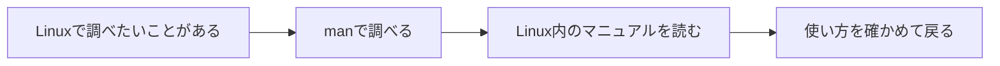
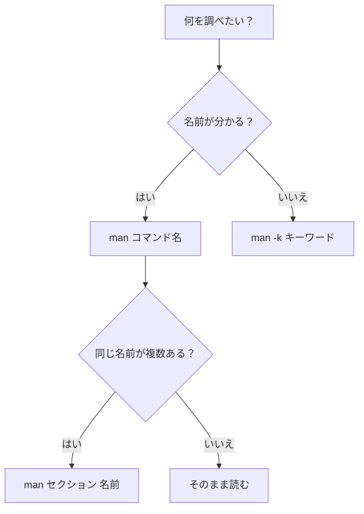

この記事では、Linuxを操作していて使い方が分からなくなったときに、`man`コマンドを使って自分で調べる方法を見ていきます。

コマンドを全部覚えることが目的ではありません。困ったときに、Linuxの中にある説明書を開けるようになることが目的です。

## インターネットにつながらない場所で困ったら

普段なら、分からないコマンドをそのまま検索できます。

でも、作業する場所がデータセンターだったらどうでしょう。

作業用端末からインターネットへ接続できなかったり、スマートフォンを持ち込めなかったりすることがあります。目の前にはLinuxの黒い画面があるのに、いつもの検索は使えません。

でも、言われる側からすると、「検索できないなら、全部覚えておいて」と言われているようで、少しだけ重たいですよね。

そんなときに使えるのが、Linuxの中に用意されているマニュアルです。

```bash
man ls
```

`man`は、manualの略です。ネット上のページを開いているのではなく、そのLinuxにインストールされている説明書を読んでいます。

そして、manが説明しているのはコマンドだけではありません。設定ファイルの書式、システムコール、ライブラリ関数、管理用コマンドなども含まれています。

manは「コマンドの使い方を調べる機能」というより、Linuxの中に置かれたリファレンス集と考えるほうが近いです。



ネットがなくても読めるのは、地味ですがかなり頼もしいところです。

ただし、`man`で読めるのは、その環境に入っているマニュアルだけです。データセンターへ行く前や、サーバーをオフライン環境へ移す前に、必要なmanページが入っているか確かめておくと安心です。

## まずは`man ls`を開いてみる

まずは、ファイルやディレクトリの一覧を表示する`ls`を調べてみます。

```bash
man ls
```

環境によって細かな表示は異なりますが、次のような画面が開きます。

```text
LS(1)                     User Commands                    LS(1)

NAME
       ls - list directory contents

SYNOPSIS
       ls [OPTION]... [FILE]...

DESCRIPTION
       List information about the FILEs ...
```

いきなり英語が並ぶので、どこを見ればよいのか迷いますよね。

まず`NAME`を見ると、`ls`が何をするものなのかを一行で確認できます。その次の`SYNOPSIS`には、実際にコマンドを入力するときの形が書かれています。

```text
ls [OPTION]... [FILE]...
```

これは、`ls`の後ろにオプションや対象のファイルを指定できる、という意味です。角括弧の`[ ]`は省略できるもの、`...`は複数指定できるものを表しています。

たとえば、次のコマンドもこの形に当てはまります。

```bash
ls -l /etc
```

- `ls`: 実行するコマンド
- `-l`: 表示方法を変えるオプション
- `/etc`: 一覧を見たい対象

SYNOPSISは、コマンドの使い方を短く圧縮したものです。最初から記号を全部理解しなくても、「この後ろに何を付けられるのか」を眺めるところからで大丈夫です。

マニュアルが開いたら、最初から全部読まなくても大丈夫です。まずは次の操作だけ知っておけば、十分に歩き始められます。

| キー | 動き |
|---|---|
| `Space` | 1画面ぶん先へ進む |
| `b` | 1画面ぶん前へ戻る |
| `/文字列` | ページ内を検索する |
| `n` | 次の検索結果へ進む |
| `N` | 前の検索結果へ戻る |
| `g` | 先頭へ移動する |
| `G` | 末尾へ移動する |
| `h` | 操作方法を表示する |
| `q` | manを閉じる |

閉じ方が分からない画面は、それだけで少し怖く見えます。最初に`q`だけ覚えておくと、気軽に開けるようになります。

## manページの見出しを知っておく

manページには、いくつかのお決まりの見出しがあります。

- `NAME`: 何をするものか
- `SYNOPSIS`: コマンドの書き方
- `DESCRIPTION`: 詳しい説明
- `OPTIONS`: オプションの意味
- `EXAMPLES`: 使用例。用意されていないページもあります
- `SEE ALSO`: 関連するmanページ

コマンドの書き方を知りたいときは、先ほど見た`SYNOPSIS`から確認します。エラーの意味を調べたいときは`ERRORS`、関連する機能を探したいときは`SEE ALSO`というように、目的に合わせて読む場所を変えられます。

manページは頭から最後まで読む本というより、必要な場所を探して読む辞書に近いものです。

## `man 1`と`man 2`は、何が違うのか

manページには「セクション」と呼ばれる章があります。

よく使うものを並べると、次のようになります。

| セクション | 主な内容 | 例 |
|---|---|---|
| `1` | 一般ユーザーが使うコマンド | `ls(1)`, `cp(1)` |
| `2` | Linuxカーネルのシステムコール | `open(2)`, `read(2)` |
| `3` | Cライブラリなどの関数 | `printf(3)` |
| `4` | デバイスや特殊ファイル | `null(4)` |
| `5` | ファイル形式や設定ファイル | `passwd(5)` |
| `6` | ゲーム | 環境によって異なる |
| `7` | 概要、規約、プロトコルなど | `man-pages(7)` |
| `8` | 主に管理者が使うコマンド | `mount(8)` |

`man 1`や`man 2`は、LinuxやUNIX系のマニュアルで伝統的に使われている章番号です。

`ls(1)`のような書き方を見かけることもあります。括弧の中はバージョン番号ではなく、「セクション1にあるlsのmanページ」という意味です。`open(2)`なら、セクション2にあるopenのページを指します。

```bash
man 1 ls
man 2 open
man 3 printf
```

コマンドを使う立場で調べるなら、まずセクション1を見ることが多いでしょう。プログラムからLinuxカーネルへ処理をお願いする仕組みを調べるなら、セクション2が出てきます。


セクション番号が必要になるのは、同じ名前のmanページが複数あるときです。

たとえば`passwd`には、パスワードを変更するコマンドの説明と、`/etc/passwd`ファイル形式の説明があります。

```bash
man 1 passwd
man 5 passwd
```

名前だけではなく、「コマンドを知りたいのか」「ファイル形式を知りたいのか」まで指定できるわけです。

同じ名前のページを順番にすべて見たいときは、`-a`も使えます。

```bash
man -a passwd
```

## 名前が分からないときは、意味から探す

ここまで読んで、「でも、調べたいコマンドの名前が分からなければ、manを開けないのでは？」と思うかもしれません。

分からないことを調べたいのに、最初から正しい名前を知っている必要があるのは、少し困りますよね。

Oracle Databaseで、表名が分かっていれば`DESC 表名`から列の構造を確認できます。Linuxのmanも、名前が分かっていれば`man ls`のように中身を確認できます。表名そのものが分からないときに一覧から探すように、manにも名前を探す方法があります。

では、名前そのものが分からないときはどうするのでしょう。

そんなときは、`man -k`でmanページの名前と短い説明を検索できます。

```bash
man -k directory
```

環境によって結果は異なりますが、次のように候補が表示されます。

```text
ls (1)      - list directory contents
mkdir (1)   - make directories
pwd (1)     - print name of current/working directory
```

ここで`mkdir`という名前を初めて知ったら、次はそのページを開けます。

```bash
man mkdir
```

つまり、次のように使い分けられます。

- 名前が分かる: `man 名前`
- 名前が分からない: `man -k キーワード`
- 名前と短い説明だけ見る: `whatis 名前`

`man -k`は短い説明を検索するため、`directory`や`password`のような英単語で探すと見つけやすいです。

`apropos`でも、ほぼ同じ検索ができます。

```bash
apropos password
```

短い説明だけでは見つからない場合は、manページの本文全体を検索する`man -K`もあります。ただし、すべてのページを読むため、検索には少し時間がかかります。

```bash
man -K "permission denied"
```

反対に、名前は分かっていて「何をするものかだけ知りたい」ときは、`whatis`が便利です。

```bash
whatis passwd
```



検索結果が出ない場合は、検索用データベースが未作成のこともあります。管理できる環境なら、`mandb`で更新できます。

```bash
sudo mandb
```

## 日本語のmanページも読める

英語のマニュアルを前にすると、内容より先に身構えてしまうことがあります。

Linuxでは、日本語に翻訳されたmanページを利用できる環境もあります。DebianやUbuntu系では、たとえば次のパッケージを事前に導入します。

```bash
sudo apt install man-db manpages manpages-ja
```

システムコールやライブラリ関数の日本語ページも読みたい場合は、開発者向けのパッケージもあります。

```bash
sudo apt install manpages-dev manpages-ja-dev
```

日本語ロケールが使える状態なら、次のように言語を指定して開けます。

```bash
LANG=ja_JP.UTF-8 man ls
```

利用できる日本語ロケールは、次のように確認できます。

```bash
locale -a | grep -i ja
```

ディストリビューションやコマンドによっては、日本語訳が用意されていなかったり、英語版より更新が遅れていたりします。細かなオプションや新しい挙動を確認するときは、英語版もあわせて見ると安心です。

```bash
LANG=C man ls
```

日本語版は入り口として使い、必要になったら英語版も見る。それくらいの距離感で十分です。

### Tera Termで日本語が文字化けするとき

サーバー側に日本語のmanページが入っていても、Tera Termの文字コードが合っていないと、文字化けしてしまいます。

ここでは、Linux側もTera Term側もUTF-8へ合わせます。

まず、接続先のLinuxで現在のロケールを確認します。

```bash
echo $LANG
locale
```

`ja_JP.UTF-8`など、UTF-8の日本語ロケールが使われていることを確認します。

次に、Tera Term側を設定します。Tera Term 5では、ざっくり次の手順です。

1. メニューから`Setup`を開く
2. `Additional settings`を開く
3. `Encoding`タブを選ぶ
4. `receive`を`UTF-8`にする
5. 送信側も別の文字コードになっている場合は、`transmit`を`UTF-8`にする
6. 設定を残す場合は、`Setup`から`Save setup`を実行する

古いTera Termでは、`Setup`の`Terminal`画面に`Kanji (receive)`と`Kanji (transmit)`があり、そこで`UTF-8`を選ぶ形式もあります。

設定後、もう一度manページを開きます。

```bash
LANG=ja_JP.UTF-8 man ls
```

文字が四角い箱のように表示される場合は、Tera Termで日本語を表示できるフォントを選んでいるかも確認します。

なお、文字コードをUTF-8にしても、英語のmanページが自動で日本語へ翻訳されるわけではありません。次の3つがそろって、はじめて日本語で表示できます。

- 日本語のmanページがインストールされている
- Linuxで日本語ロケールを利用できる
- Tera Termの受信文字コードがUTF-8になっている

## manページは、そのサーバーに残された手がかり

manページのよいところは、オフラインで読めることだけではありません。

Web検索では、新しいバージョンの記事や別のディストリビューションの説明が見つかることがあります。それに対して、サーバー内のmanページは、その環境に導入されたソフトウェアと一緒に配布されていることが多く、目の前の環境を知る手がかりになります。

もちろん、manページだけですべて解決するわけではありません。設定例が少なかったり、翻訳が古かったりすることもあります。

それでも、ネットにつながらない場所で「このオプションは何だろう」と立ち止まったとき、Linux自身に聞ける方法を知っていると、黒い画面との距離は少し縮まります。

まずは、man自身の説明書を開いてみてください。

```bash
man man
```

説明書の説明書です。少し不思議ですが、Linuxらしい入口でもあります。

## 参考

- [man(1) - an interface to the system reference manuals](https://man7.org/linux/man-pages/man1/man.1.html)
- [Linux man-pages: man-pages(7)](https://man7.org/linux/man-pages/man7/man-pages.7.html)
- [Debian: manpages-ja](https://packages.debian.org/trixie/manpages-ja)
- [Debian: manpages-ja-dev](https://packages.debian.org/trixie/manpages-ja-dev)
- [Tera Term 5: Additional settings / Encoding](https://teratermproject.github.io/manual/5/en/menu/setup-additional-coding.html)
- [Tera Term 5: Save setup](https://teratermproject.github.io/manual/5/en/menu/setup-save.html)
- [Tera Term 4: Terminal setup / Japanese mode](https://teratermproject.github.io/manual/4/en/menu/setup-terminal_ja.html)

---

## ご紹介

感想をもとにコンテンツを改善しながら、いずれは実機サーバーに触れる演習も用意していく予定です。

まずは Linux の基礎を読んでみてください。

**Linux の基礎:** https://infra-study.org/part1-chapter01

**感想フォーム:** https://tally.so/r/eqvX8l

---

この記事は、infra-study「Part 1 / Chapter 1」でLinuxの基礎を読むときの、おまけとして作成しています。

よかったら見てみてください。

X（@taro3_01）で更新を告知しています。フォローすると次回の通知が届きます。

@[card](https://x.com/taro3_01)
