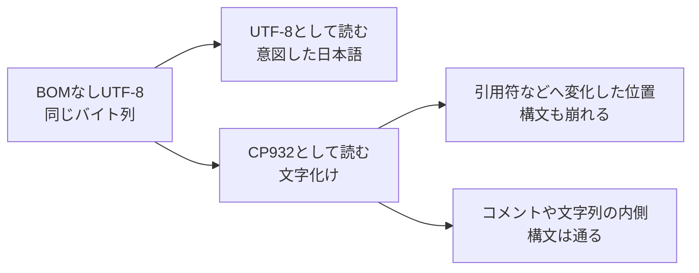
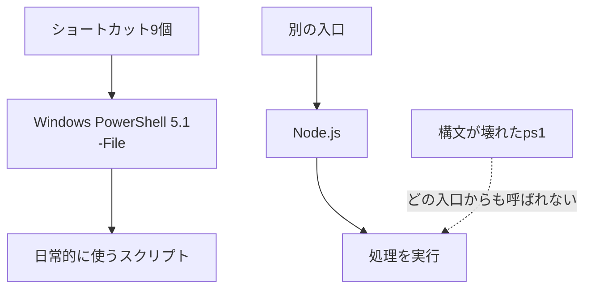

前日まで押せていた、サーバを起動するボタンが動かなくなりました。押した直後に見覚えのない構文エラーが出て、サーバは起きず、スクリプトを読み込むところで止まりました。

*「昨日まで動いていたのに、なぜ今日だけ壊れた？」*

最初に疑ったのは、起動処理の中身をどこかで変えてしまった可能性です。直近の作業を思い返しても、少なくともその処理を変えた覚えはありませんでした。

調べ始めた時点で、手がかりとして見えていたのは、画面に出た構文エラー1件だけでした。中身の処理ではなく、PowerShell がファイルを読む段階で何か変わったのではないか、と考えました。

ただ、構文エラーが出た1本だけを直して終わってよいのかは分かりません。同じ状態のファイルがほかにもあるなら、なぜ前日まで見つからなかったのでしょう。

**この記事で分かること**

- 手元の `.ps1` に同じ地雷があるか、BOM の有無と文字種からその場で数えられます。
- 構文エラーが出なくても無事とは限らないと、UTF-8 と CP932 で読まれた文字を突き合わせて判定できます。
- 目に見えて壊れた1本だけでなく、同じ読み違えを起こす9本まで直す範囲を広げる判断ができます。

## まず、先頭の3バイトを見た

最初に確かめたのは中身ではなく、UTF-8 の BOM を示す先頭の `EF BB BF` でした。
これは見た目では分からないため、ファイルを開かずにバイト列として読みました。

```powershell
$path = '.\サーバを起動するスクリプト.ps1'
$bytes = [System.IO.File]::ReadAllBytes($path)
$hasBom = $bytes.Length -ge 3 -and
    [BitConverter]::ToString($bytes, 0, 3) -eq 'EF-BB-BF'
"HasUtf8Bom: $hasBom"
```

```text
HasUtf8Bom: False
```

公開用にファイル名は役割へ置き換えましたが、実際の確認でも、先頭3バイトは `EF BB BF` ではありませんでした。
Windows PowerShell 5.1 は、BOM のないスクリプトを既定の ANSI コードページで読みます。自分の日本語環境で、実際に選ばれたのが CP932 でした。
元のファイルは BOM なし UTF-8 なので、同じバイト列を別の文字コードで読めば、日本語は別の文字へ変わります。



ここで気になったのは、壊れたファイルだけ直せば終わるのか、ということでした。

## 26本をバイト列から数え直した

手元にある `.ps1` を全部集め、BOM の有無と、ASCII 以外の文字を含むかどうかを調べました。
UTF-8 として厳密にデコードできることも確かめ、壊れたバイト列を都合よく文字列へ変換しないようにしました。

```powershell
$scriptRoot = (Resolve-Path '.\scripts').Path.TrimEnd('\')
$utf8Strict = [System.Text.UTF8Encoding]::new($false, $true)

$inventory = Get-ChildItem -LiteralPath $scriptRoot -Filter '*.ps1' -File -Recurse |
    ForEach-Object {
        $bytes = [System.IO.File]::ReadAllBytes($_.FullName)
        $hasBom = $bytes.Length -ge 3 -and
            [BitConverter]::ToString($bytes, 0, 3) -eq 'EF-BB-BF'
        $body = if ($hasBom) { $bytes[3..($bytes.Length - 1)] } else { $bytes }
        $text = $utf8Strict.GetString([byte[]]$body)

        [pscustomobject]@{
            File        = $_
            HasBom      = $hasBom
            HasNonAscii = $text -match '[^\x00-\x7F]'
        }
    }

[pscustomobject]@{
    Total = $inventory.Count
    NoBom = @($inventory | Where-Object { -not $_.HasBom }).Count
    NoBomAndNonAscii = @($inventory | Where-Object {
        -not $_.HasBom -and $_.HasNonAscii }).Count
    NoBomAndAsciiOnly = @($inventory | Where-Object {
        -not $_.HasBom -and -not $_.HasNonAscii }).Count
}
```

```text
Total             : 26
NoBom             : 15
NoBomAndNonAscii  : 9
NoBomAndAsciiOnly : 6
```

`.ps1` は26本あり、BOM なしは15本、そのうち日本語などの非 ASCII 文字を含むものは9本でした。

*「壊れたのは1本なのに、同じ入口に9本いる」*

残る6本は ASCII だけなので、今は UTF-8 と CP932 のどちらで読んでも、同じ文字に見えます。
ただ、日本語を1文字足した瞬間に条件が変わるため、この6本は無害ではなく、まだ症状が出ていない予備軍でした。

## 9本とも壊れる、と思った

BOM がなく、日本語を含むファイルが9本——ここまでは、9本すべてが構文エラーになると思っていました。
でも、推測のまま9本を「故障」と数えず、Windows PowerShell 5.1 のパーサーへ1本ずつ渡しました。
次のコマンドは、Windows PowerShell 5.1 の画面で実行しています。PowerShell 7 では読み取り条件が変わり、同じ事故を再現できないためです。

```powershell
$parseResults = $inventory |
    Where-Object { -not $_.HasBom -and $_.HasNonAscii } |
    ForEach-Object {
        $tokens = $null
        $errors = $null
        [System.Management.Automation.Language.Parser]::ParseFile(
            $_.File.FullName, [ref]$tokens, [ref]$errors
        ) | Out-Null
        [pscustomobject]@{ File = $_.File; ErrorCount = @($errors).Count }
    }

[pscustomobject]@{
    Checked          = $parseResults.Count
    SyntaxErrorFiles = @($parseResults | Where-Object {
        $_.ErrorCount -gt 0 }).Count
    SyntaxOkFiles    = @($parseResults | Where-Object {
        $_.ErrorCount -eq 0 }).Count
}
```

```text
Checked          : 9
SyntaxErrorFiles : 1
SyntaxOkFiles    : 8
```

構文エラーが出たのは、9本中1本だけでした。残り8本は、Windows PowerShell 5.1 でも構文としては通っています。

*「では、残り8本は直さなくていいのか？」*

ここで最初の説明が崩れ、BOM がないだけで必ず構文が壊れるなら、結果は1対8にならないはずだと気づきました。

## 構文ではなく、読まれた文字を比べた

次は同じバイト列を UTF-8 と CP932 の両方で読み、構文ではなく、文字列そのものが一致するかを見ました。

```powershell
$cp932 = [System.Text.Encoding]::GetEncoding(932)

$decodeResults = $inventory |
    Where-Object { -not $_.HasBom -and $_.HasNonAscii } |
    ForEach-Object {
        $bytes = [System.IO.File]::ReadAllBytes($_.File.FullName)
        $asUtf8 = $utf8Strict.GetString($bytes)
        $asCp932 = $cp932.GetString($bytes)
        [pscustomobject]@{ File = $_.File; TextDifferent = $asUtf8 -cne $asCp932 }
    }

[pscustomobject]@{
    Checked       = $decodeResults.Count
    TextDifferent = @($decodeResults | Where-Object {
        $_.TextDifferent }).Count
}
```

```text
Checked       : 9
TextDifferent : 9
```

9本すべてで読まれた文字が変わっており、構文が通った8本も、正しく読めていたわけではありません。
前日に止まった1本では、化けた日本語の一部が、たまたま引用符やバックティックとして解釈される位置にありました。
その結果、文字列の境界や行の続き方まで変わり、PowerShell の文法として成立しなくなっていました。
一方の8本では変化がコメントや文字列の内側に収まり、読める文字は壊れていても、構文の骨組みだけは残りました。

:::message alert
「構文エラーが0」は、「意図した文字列として動く」と同じ判定ではありません。表示文、ログ、検索語、引数に日本語があれば、構文が通っても処理結果は変わり得ます。
:::

ここで、原因は「BOM がないと構文が壊れる」ではないと分かりました。
**BOM がないため読み違えが起き、その文字化けが文法記号へ触れた1本だけ、構文まで壊れました。**
ここまで原因を一段深く言うと、構文が通っていた残り8本も是正対象になります。

## ボタン9個の呼び先も開いた

ファイル側を数えたあと、デスクトップに置いた9個のショートカットも調べました。
Windows の `.lnk` は名前だけでは呼び先が分からないため、`WScript.Shell` で実行ファイルと引数を開きました。

```powershell
$shortcutRoot = [Environment]::GetFolderPath('Desktop')
$shell = New-Object -ComObject WScript.Shell

$shortcutRows = Get-ChildItem -LiteralPath $shortcutRoot -Filter '*.lnk' -File |
    ForEach-Object {
        $link = $shell.CreateShortcut($_.FullName)
        $isWindowsPowerShell = [System.IO.Path]::GetFileName(
            $link.TargetPath) -ieq 'powershell.exe'
        $usesFile = $link.Arguments -match '(?i)(^|\s)-File(\s|$)'
        [pscustomobject]@{
            Shortcut = $_; IsWindowsPowerShell = $isWindowsPowerShell
            UsesFile = $usesFile
        }
    }

[pscustomobject]@{
    ShortcutCount = $shortcutRows.Count
    WindowsPowerShellWithFile = @($shortcutRows | Where-Object {
        $_.IsWindowsPowerShell -and $_.UsesFile }).Count
}
```

```text
ShortcutCount             : 9
WindowsPowerShellWithFile : 9
```

9個すべてが、Windows PowerShell 5.1 を `-File` 付きで直接呼んでいました。
つまり、今回の読み違えは一部の管理用ファイルだけではなく、普段押していた停止用ボタンでも毎回起きていました。
それでも、はっきり構文が崩れていた1本は、9個のどのショートカットからも呼ばれていませんでした。
その処理には Node.js を経由する別の入口があり、日常の操作では、壊れた PowerShell ファイルを通りません。

*「使っていないから、壊れていても見つからなかったのか」*

使う資産はボタンを押すたびに動作確認されますが、使われない資産には、その確認の瞬間が来ません。



ファイル一覧だけでは関係が分からず、入口の一覧と資産の一覧を突き合わせて、初めて未使用の1本が浮きました。

## 本文を触らず、3バイトだけ足した

是正対象は、BOM なしで非 ASCII 文字を含む9本にしました。
ただ、改行や末尾空白まで変わると差分が混ざるため、エディターで開いて保存し直す方法は避けました。
付与前のファイルは同じ相対パスで別の場所へ退避し、元のバイト列の前へ `EF BB BF` だけを足しました。

```powershell
$targets = $inventory |
    Where-Object { -not $_.HasBom -and $_.HasNonAscii } |
    ForEach-Object { $_.File }

$backupRoot = Join-Path $env:TEMP ('ps1-before-bom-' +
    (Get-Date -Format 'yyyyMMdd-HHmmss'))
$bom = [byte[]](0xEF, 0xBB, 0xBF)

foreach ($file in $targets) {
    $relative = $file.FullName.Substring($scriptRoot.Length).TrimStart('\')
    $backupPath = Join-Path $backupRoot $relative
    New-Item -ItemType Directory -Path (Split-Path $backupPath) -Force |
        Out-Null
    Copy-Item -LiteralPath $file.FullName -Destination $backupPath
    $body = [System.IO.File]::ReadAllBytes($file.FullName)
    [System.IO.File]::WriteAllBytes($file.FullName, [byte[]]($bom + $body))
}

"BOM added: $($targets.Count)"
```

```text
BOM added: 9
```

この作業で変えてよいのは先頭の3バイトだけなので、退避したファイルと、付与後の4バイト目以降を比較しました。

```powershell
$bodyChecks = foreach ($file in $targets) {
    $relative = $file.FullName.Substring($scriptRoot.Length).TrimStart('\')
    $before = [System.IO.File]::ReadAllBytes((Join-Path $backupRoot $relative))
    $after = [System.IO.File]::ReadAllBytes($file.FullName)
    $afterBody = [byte[]]$after[3..($after.Length - 1)]
    [Convert]::ToBase64String($before) -ceq
        [Convert]::ToBase64String($afterBody)
}

[pscustomobject]@{
    Checked       = $bodyChecks.Count
    BodyUnchanged = @($bodyChecks | Where-Object { $_ }).Count
}
```

```text
Checked       : 9
BodyUnchanged : 9
```

9本とも本文は1バイトも変わっておらず、変更は、各ファイルの先頭へ付けた3バイトだけでした。

## 付けたあと、同じ条件で測り直した

最後に、Windows PowerShell 5.1 で同じ9本を読み直しました。
見るのは、構文エラー、日本語を含む本文の一致、置換文字 `U+FFFD` の3点です。

```powershell
$verify = foreach ($file in $targets) {
    $relative = $file.FullName.Substring($scriptRoot.Length).TrimStart('\')
    $beforeBytes = [System.IO.File]::ReadAllBytes((Join-Path $backupRoot $relative))
    $expected = $utf8Strict.GetString($beforeBytes)
    $actual = Get-Content -LiteralPath $file.FullName -Raw
    $tokens = $null
    $errors = $null
    [System.Management.Automation.Language.Parser]::ParseFile(
        $file.FullName, [ref]$tokens, [ref]$errors
    ) | Out-Null
    [pscustomobject]@{
        SyntaxError = @($errors).Count -gt 0
        TextMatches = $actual -ceq $expected
        HasReplacementCharacter = $actual.Contains([char]0xFFFD)
    }
}

[pscustomobject]@{
    Checked                  = $verify.Count
    SyntaxErrorFiles         = @($verify | Where-Object SyntaxError).Count
    TextMatchesFiles         = @($verify | Where-Object TextMatches).Count
    ReplacementCharacterFiles = @($verify | Where-Object {
        $_.HasReplacementCharacter }).Count
}
```

```text
Checked                   : 9
SyntaxErrorFiles          : 0
TextMatchesFiles          : 9
ReplacementCharacterFiles: 0
```

構文エラーは0になり、9本とも意図した UTF-8 の本文と一致し、置換文字もありませんでした。
前日の事故だけなら直す対象は起動用の1本に見えますが、原因までたどると対象は9本でした。

## 扱わない範囲

この記事で扱うのは、日本語環境で Windows PowerShell 5.1 を使う場合です。対象は、BOM なし UTF-8 の `.ps1` をファイルから読む場面に限ります。
PowerShell 6以降は、テキスト出力の既定が BOM なし UTF-8 へ変わりました。そのため、PowerShell Core / PowerShell 7 は今回の読み違えの対象外です。

また、スクリプト署名、実行ポリシー、改行コード、エディター全体の保存設定までは触れません。
両方で同じファイルを使う場合は保存の基準を別に決めますが、この記事では、その共存方針までは扱いません。

## まとめ：症状の数ではなく、原因の数を直す

同じ読み違えが9本にあり、目に見えて壊れたのは1本でした——残る8本まで拾うには、症状ではなく原因から横へたどります。

## 参考

- [Microsoft Learn: about_Character_Encoding](https://learn.microsoft.com/powershell/module/microsoft.powershell.core/about/about_character_encoding)
- [Microsoft Learn: Parser.ParseFile Method](https://learn.microsoft.com/dotnet/api/system.management.automation.language.parser.parsefile)

---

## ご紹介

自分は、自宅に物理サーバーを置いて、インフラを学べる場所を作っています。

教材は登録なしで無料で読めます。実機のサーバーに接続する演習は構築中で、まだ全章には対応していません。

**全章インデックス:** [infra-study.org/curriculum](https://infra-study.org/curriculum)

**感想フォーム:** [感想フォーム（Tally）](https://tally.so/r/eqvX8l)

---

X（@taro3_01）で更新を告知しています。フォローすると次回の通知が届きます。

@[card](https://x.com/taro3_01)
