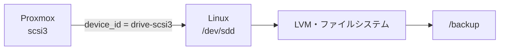
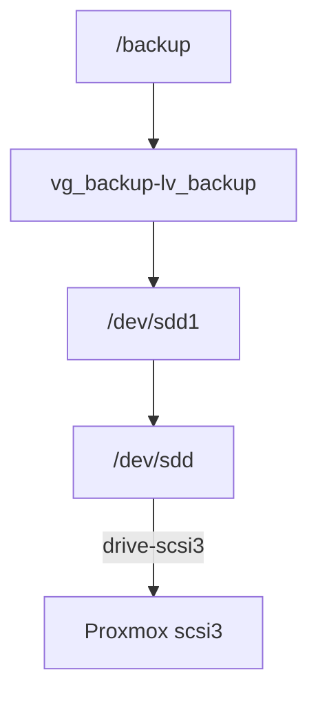

この記事では、Proxmox上のLinux仮想マシンに同じ容量のディスクが複数あるとき、拡張するディスクを **Proxmoxが最初から各ディスクに付けている識別子** で特定する方法を見ていきます。

新しくシリアル番号を振らなくても、仮想マシンを稼働させたまま、`scsi3`がLinuxのどのディスクかを対応付けられます。

100GBのディスクが5本あり、そのうち1本だけを120GBへ拡張する。作業そのものは難しく見えないかもしれません。

でも、Proxmox側にも100GBが5本、Linux側にも100GBが5本見えていたら、どれを選べばよいのでしょう。

「たぶん`scsi3`が`/dev/sdd`だろう」で進めるには、少し怖い作業です。

## 100GBが5本。サイズだけでは区別できない

今回の仮想マシンには、次のディスクが接続されているものとします。

```text
Proxmox
├─ scsi0  100GB
├─ scsi1  100GB
├─ scsi2  100GB
├─ scsi3  100GB
└─ scsi4  100GB
```

Linux側でも確認してみます。

```bash
lsblk -d -o NAME,SIZE,MODEL
```

```text
NAME  SIZE MODEL
sda   100G QEMU HARDDISK
sdb   100G QEMU HARDDISK
sdc   100G QEMU HARDDISK
sdd   100G QEMU HARDDISK
sde   100G QEMU HARDDISK
```

容量もモデル名も同じです。これだけでは、Proxmoxの`scsi3`がLinuxのどのディスクなのか分かりません。

Linuxの`/dev/sdb`や`/dev/sdc`という名前は、常に同じ順番になると約束された管理番号ではありません。再起動や構成変更をまたいで使う識別情報としては弱いため、並び順だけで判断しないほうが安全です。

## わざわざシリアルを振らなくてもいい

「ディスクごとに`serial`を設定すれば対応付けられる」という方法もあります。ただ、これは実運用では少し重たい選択です。

- ディスク1本ずつに`serial`を設定する手間がかかる
- `serial`はQEMUが仮想マシンを起動するときに渡す値なので、反映には **仮想マシンの完全停止→起動（ダウンタイム）** が必要
- すでに動いている仮想マシンには、後付けで設定し直すことになる

実は、Proxmoxは`serial`を振らなくても、**SCSIディスク1本ずつに一意な識別子を最初から付けています**。`scsi3`なら`drive-scsi3`という具合です。これはゲストのLinuxからそのまま読めるので、稼働中の仮想マシンでも、止めずに対応付けられます。



この記事では、この「最初から付いている値」を使って対応付けます。役割の分かる名前を自分で付けたい場合の`serial`方式は、最後に補足として触れます。

## Linux側で「最初から付いている値」を見る

ゲストのLinuxにログインして、`lsblk`に`SERIAL`と`HCTL`の列を足します。

```bash
lsblk -d -o NAME,SIZE,SERIAL,HCTL
```

```text
NAME  SIZE SERIAL       HCTL
sda   100G drive-scsi0  0:0:0:0
sdb   100G drive-scsi4  1:0:0:4
sdc   100G drive-scsi1  2:0:0:1
sdd   100G drive-scsi3  3:0:0:3
sde   100G drive-scsi2  4:0:0:2
```

ここに、Proxmoxとの対応がそのまま出ています。読み方は2つあります。

- **`SERIAL`列**: `drive-scsiN`がProxmoxの`scsiN`に対応します。`sdd`の`drive-scsi3`は`scsi3`です。
- **`HCTL`列**: `H:C:T:L`のうち末尾の`L`（LUN）が`scsi`番号に一致します。`sdd`は`3:0:0:3`なので`scsi3`です。

この例では、Linux側のデバイス名（`sda`〜`sde`）の並びとProxmoxの`scsi`番号の並びが一致していません。それでも、`SERIAL`や`HCTL`を見れば`/dev/sdd = scsi3`だと分かります。

:::message
`SERIAL`列に`drive-scsiN`が出るかどうかは、ディストリビューションやudevのバージョンによって差があります。値が空欄になる環境でも、`HCTL`のLUNと、次に紹介する`/dev/disk/by-id/`は安定して使えます。
:::

確実に裏を取りたいときは、`/dev/disk/by-id/`を見ます。Proxmoxの識別子がそのままシンボリックリンク名になっています。

```bash
ls -l /dev/disk/by-id/ | grep 'drive-scsi'
```

```text
scsi-0QEMU_QEMU_HARDDISK_drive-scsi0 -> ../../sda
scsi-0QEMU_QEMU_HARDDISK_drive-scsi1 -> ../../sdc
scsi-0QEMU_QEMU_HARDDISK_drive-scsi2 -> ../../sde
scsi-0QEMU_QEMU_HARDDISK_drive-scsi3 -> ../../sdd
scsi-0QEMU_QEMU_HARDDISK_drive-scsi4 -> ../../sdb
```

`drive-scsi3`が`../../sdd`を指しています。`scsi3 = /dev/sdd`が、これではっきりしました。

## Proxmox側でも構成を確認しておく

念のため、Proxmoxホスト側でも構成を確認します。以降の`qm`コマンドは、Linux仮想マシンの中ではなく、Proxmoxホストで実行します。

サンプルではVM IDを`101`とします。

```bash
qm config 101 | grep '^scsi'
```

```text
scsi0: local-lvm:vm-101-disk-0,size=100G
scsi1: local-lvm:vm-101-disk-1,size=100G
scsi2: local-lvm:vm-101-disk-2,size=100G
scsi3: local-lvm:vm-101-disk-3,size=100G
scsi4: local-lvm:vm-101-disk-4,size=100G
scsihw: virtio-scsi-single
```

ここで確認したいのは、`scsi0`などの接続先と、`vm-101-disk-0`などのボリューム名です。拡張対象が`scsi3`なら、対応するボリュームは`vm-101-disk-3`だと分かります。

## マウントポイントから親ディスクまでたどる

実際には「`scsi3`を拡張したい」ではなく、「`/backup`を広げたい」から始まることが多いはずです。マウントポイントから、`scsi`番号までたどってみます。

今回、容量を増やしたいのは`/backup`とします。

```bash
df -hT /backup
```

```text
Filesystem                       Type  Size  Used Avail Use% Mounted on
/dev/mapper/vg_backup-lv_backup  xfs    99G   91G  8.0G  92% /backup
```

この表示から分かるのは、`/backup`がLVMの論理ボリューム上にあることです。まだProxmoxのどのディスクかは分かりません。

`lsblk`のツリーで親をたどります。`SERIAL`列を付けておくのがポイントです。

```bash
lsblk -o NAME,SIZE,TYPE,FSTYPE,SERIAL,MOUNTPOINTS
```

```text
NAME                         SIZE TYPE FSTYPE      SERIAL       MOUNTPOINTS
sdd                          100G disk             drive-scsi3
└─sdd1                       100G part LVM2_member
  └─vg_backup-lv_backup       99G lvm  xfs                      /backup
```

これで、次の対応関係を確認できました。



ここまでたどって、初めて拡張対象が`scsi3`だと判断できます。

## 特定した`scsi3`を拡張する

Proxmox側へ戻り、対象と現在の構成をもう一度確認します。

```bash
qm config 101 | grep '^scsi3:'
```

```text
scsi3: local-lvm:vm-101-disk-3,size=100G
```

100GBから20GB追加する場合は、次のように指定できます。

```bash
qm disk resize 101 scsi3 +20G
```

Proxmoxの公式CLIでは、先頭に`+`を付けると現在の容量へ追加する指定になります。縮小はできないため、対象と追加容量を確認してから実行します。

:::message alert
`qm disk resize`は対象を間違えると別のディスクを広げてしまいます。実行前に、ここまでの`SERIAL` / `by-id`の対応と、`qm config`のボリューム名を必ず照合してください。
:::

実行後、Proxmox側で120GBになったことを確認します。

```bash
qm config 101 | grep '^scsi3:'
```

```text
scsi3: local-lvm:vm-101-disk-3,size=120G
```

## Proxmoxで広げただけでは終わらない

ここで増えたのは、仮想ディスクそのものの容量です。

Linux側では、構成に応じて次の作業が残ります。

- Linuxに新しいディスク容量を認識させる
- パーティションを拡張する
- LVMのPVを拡張する
- LVを拡張する
- XFSやext4などのファイルシステムを拡張する

必要なコマンドは、パーティションの有無、LVM構成、ファイルシステムによって変わります。ここを一つの手順として決め打ちすると危険なので、この記事では「どの仮想ディスクを拡張するかを特定する」ところを中心にしました。

## 補足：役割名を付けたいなら`serial`を足す

`drive-scsi3`という値は機械的で、ぱっと見て用途までは分かりません。「このディスクはバックアップ用」と人が読んで分かる名前にしたい場合は、Proxmox側で`serial`を設定できます。

```bash
qm set 101 --scsi3 local-lvm:vm-101-disk-3,serial=VM101-BACKUP,size=100G
```

設定すると、ゲストの`lsblk`の`SERIAL`列に`VM101-BACKUP`が出るようになり、`/dev/disk/by-id/`にも`scsi-SQEMU_QEMU_HARDDISK_VM101-BACKUP`というリンクが増えます。

ただし、次の点に注意してください。

- 反映には **仮想マシンの完全停止→起動** が必要です（ゲストOSの再起動だけでは反映されません。`serial`はQEMUが起動時にディスクへ渡す値のため。なお、このときディスクの中身は消えません）。
- 既存ディスクに`discard`・`iothread`・`cache`・`ssd`などの設定がある場合は、元の値を残したうえで`serial`を追加します。ボリューム名を間違えると別のディスクを接続するおそれがあるため、`qm config`の結果と照合してから変更します。
- `udevadm`で確認するときは、自分で設定したシリアルは`ID_SCSI_SERIAL`に出ます。`ID_SERIAL`のほうはProxmoxが付ける`drive-scsi3`のような内部識別子で、別物です。

```bash
udevadm info --query=property --name=/dev/sdd | grep -E 'ID_SCSI_SERIAL=|ID_SERIAL='
```

```text
ID_SCSI_SERIAL=VM101-BACKUP
ID_SERIAL=0QEMU_QEMU_HARDDISK_drive-scsi3
```

役割名が要らないなら、ここまで見てきたとおり、最初から付いている`drive-scsiN`で十分です。

## 実機での検証ログ

この記事の対応関係（`drive-scsiN` = Proxmoxの`scsiN`、`HCTL`のLUN = `scsi`番号、`+`での加算と縮小拒否）は、実機のProxmox VE 9.1 + virtio-scsiで確認しています。識別に関わる部分だけ抜粋します。

:::details 実機の出力（クリックで展開）

```text
# ゲスト: serial を振っていないディスクでも、scsi番号が一意に分かる
$ lsblk -o NAME,SIZE,TYPE,SERIAL,WWN,HCTL
sda   32G disk drive-scsi0     0:0:0:0
sdb    1G disk drive-scsi7     3:0:0:7
sdc    1G disk drive-scsi8     4:0:0:8
# （sdb/sdc は検証用に scsi7/scsi8 として後から接続したもの。
#   drive-scsiN とHCTLのLUNが、そのまま scsi 番号に一致しているのが分かる）

# by-id にも scsi 番号がそのまま出る
$ ls -l /dev/disk/by-id/ | grep drive-scsi
scsi-0QEMU_QEMU_HARDDISK_drive-scsi0 -> ../../sda
scsi-0QEMU_QEMU_HARDDISK_drive-scsi7 -> ../../sdb
scsi-0QEMU_QEMU_HARDDISK_drive-scsi8 -> ../../sdc

# by-path / udevadm でも一致（末尾 :N が scsi 番号）
$ udevadm info --query=property --name=/dev/sdb | grep -E 'ID_SERIAL=|ID_PATH='
ID_SERIAL=0QEMU_QEMU_HARDDISK_drive-scsi7
ID_PATH=pci-0000:01:08.0-scsi-0:0:0:7

# resize は + で加算、縮小は拒否される
$ qm disk resize <VMID> scsi3 +1G
  ... successfully resized.
$ qm disk resize <VMID> scsi3 1G
shrinking disks is not supported
```

:::

## まとめ：サイズではなく、根拠で選ぶ

100GBのディスクが5本並んでいるとき、サイズは識別情報になりません。

`scsi3`と`/dev/sdd`の並びが同じに見えても、それだけでは根拠として弱いものです。

でも、Proxmoxは最初から各ディスクに`drive-scsiN`という一意な値を付けています。わざわざシリアルを振り直さなくても、これをLinux側から読むだけで対応付けられます。

```text
マウントポイント
    ↓
LVM・パーティション
    ↓
Linuxのディスク
    ↓ drive-scsiN（= scsi番号）
Proxmoxの仮想ディスク
```

この線をたどれるようにしておけば、ディスクが同じ容量でも、稼働させたまま、落ち着いて対象を選べます。

## 参考

- [Proxmox VE: qm.conf](https://pve.proxmox.com/pve-docs/qm.conf.5.html)
- [Proxmox VE: qm command line tool](https://pve.proxmox.com/pve-docs/qm.1.html)
- [Linux manual page: lsblk(8)](https://man7.org/linux/man-pages/man8/lsblk.8.html)

---

## ご紹介

自分は、自宅に物理サーバーを置いて、インフラを学べる場所を作っています。

教材は登録なしで無料で読めます。実機のサーバーに接続する演習は構築中で、まだ全章には対応していません。

**全章インデックス:** [infra-study.org/curriculum](https://infra-study.org/curriculum)

**感想フォーム:** [感想フォーム（Tally）](https://tally.so/r/eqvX8l)

---

X（@taro3_01）で更新を告知しています。フォローすると次回の通知が届きます。

@[card](https://x.com/taro3_01)
