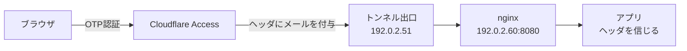

自宅ラボのブラウザ運用ツール（Apache Guacamole）に、Cloudflare Access の**シングルサインオン（SSO）**を載せようとして、危うく「誰でも他人になりすませる」状態を作りかけた話です。

便利な「ヘッダ認証」には、設定を一歩間違えると**認証を丸ごとバイパスできる穴**が空きます。しかもその穴は、よくある「XFF を信じる」対策だと**塞いだつもりで塞げていない**。実機で送信元IPを測って、設計をひっくり返した記録です。

## 何がやりたかったか（マクロ）

やりたいのはシンプルで、

- 入口に **Cloudflare Access**（メールでワンタイム認証）を置く
- 通った人のメールを、後ろのアプリに「あなたは誰々さん」と教えて**二重ログインを消す**

Cloudflare Access は、認証を通すと **HTTP ヘッダ**にメールを書いて後ろへ渡してくれます。

```
Cf-Access-Authenticated-User-Email: you@example.com
```

アプリ側（今回は Guacamole の「ヘッダ認証」拡張）は、このヘッダを見て「この人＝you@example.com」としてログイン扱いにする。これが**ヘッダ認証 SSO**です。

### ちょっと寄り道：HTTPヘッダって何？　誰が貼るの？

「ヘッダ」と聞くとメールのヘッダを思い浮かべるかもしれませんが、別物です。Web のリクエストは本文だけでなく、先頭に**付箋（ヘッダ）が何枚も付いた小包**だと思ってください。1枚は単なる `名前: 値` のテキストで、たとえば「どのブラウザか(`User-Agent`)」「どんな形式が欲しいか(`Accept`)」などが入っています。

ここで大事なのは2つ。

- このメールの付箋は、**あなたが毎回書くものではなく、Cloudflare Access が認証通過者に自動で貼る**もの（後ろのアプリは読むだけ）。
- そして付箋は、**送る側が手で何でも書ける**ただのテキスト。`curl -H "Cf-Access-Authenticated-User-Email: ..."` と打てば誰でも好きな値を付けられます。

この「自動で貼られる便利さ」と「手で偽造できる手軽さ」が同居しているのが、次の落とし穴の正体です。

## どこに穴が空くか（ミクロ）

問題は、**HTTP ヘッダは送る側が自由に書ける**こと。

正規の経路はこうです。



ところが、アプリの前段 nginx が **LAN全体に向けて空いていた**らどうなるか。同じ LAN の誰かが Cloudflare を経由せず、nginx を直接叩いて、

```
GET / HTTP/1.1
Cf-Access-Authenticated-User-Email: victim@example.com   ← 自分で書くだけ
```

を送ると、アプリは `victim@example.com` として**ログインを通してしまう**。OTP もパスワードも要りません。これが「ヘッダ認証をそのまま信じる」ことの怖さです。

:::message alert
ヘッダ認証は「**信頼できる経路から来たヘッダ**」が大前提。経路を縛らずにヘッダを信じると、認証層がまるごと飾りになります。
:::

## よくある対策（XFF を信じる）が、実はあてにならない

ネットで見つかる定番は「`X-Forwarded-For`（XFF）で送信元を復元して、トンネル出口のIPだけ `allow` する」というもの。

```nginx
set_real_ip_from 192.0.2.51;
real_ip_header   X-Forwarded-For;
allow 192.0.2.51;
deny  all;
```

でもこれ、**両側に穴**があります。

- 直叩きする攻撃者が `X-Forwarded-For: 192.0.2.51` を**偽装**すれば、`real_ip` が出口IPに化けて `allow` を突破できる。
- 逆に、トンネル出口が実クライアントIPを XFF に入れる構成だと、正規利用が `allow` から外れて**全部 403**（自分を締め出す）。

つまり XFF を信頼の根拠にした時点で、信頼の前提が崩れています。

## 実機で測ってから決める（ここが肝）

XFF をこねる前に、**「素の状態で nginx には送信元IPが何に見えているか」**を実測しました。コンテナの公開ポート（`0.0.0.0:8080->80`）越しだと、送信元が Docker のゲートウェイIPに化ける、という通説があるからです。

ゲートを何も入れていない状態で、別々のホストから直接叩いてアクセスログを見ます。

```bash
# トンネル出口ホスト(192.0.2.51) から
curl -s -o /dev/null -w '%{http_code}\n' http://192.0.2.60:8080/probe-a
# 別のLANホスト(192.0.2.254) から
curl -s -o /dev/null -w '%{http_code}\n' http://192.0.2.60:8080/probe-b
```

nginx のアクセスログ（`$remote_addr` を出すだけのログ書式）はこうでした。

```
192.0.2.51  "GET /probe-a HTTP/1.1" 404
192.0.2.254 "GET /probe-b HTTP/1.1" 404
```

**結論：送信元の実IPがそのまま見えていた**（ゲートウェイに化けない／XFF も付いていない）。

これで設計が決まります。**XFF は一切使わない**。生の `$remote_addr` に直接 `allow` を効かせれば、偽装のしようがありません（ヘッダは書けても、TCPの送信元IPは書き換えられない）。

```nginx
# 送信元 = トンネル出口だけ受理（XFFは信じない）
allow 192.0.2.51;
deny  all;
```

:::message
「定番の対策をコピペ」ではなく「自分の環境で1回測る」。今回はこれで、攻撃面（XFF偽装）を**設定から消す**判断ができました。測らずに XFF 版を入れていたら、穴を残したまま安心していたはずです。
:::

## もう一段：通行証(JWT)の存在チェック

送信元を縛っても、「トンネル出口ホストそのものが乗っ取られたら？」が残ります。そこで保険として、Cloudflare Access が付ける**通行証（JWT）**が在るかも見ます。

```nginx
# JWTが空 or 3パート(xxx.yyy.zzz)でなければ 401
map $http_cf_access_jwt_assertion $cf_jwt_ok {
    default                  0;
    "~^[^.]+\.[^.]+\.[^.]+$" 1;
}
server {
    location / {
        if ($cf_jwt_ok = 0) { return 401; }
        # ...
    }
}
```

検証するとこうなります。

```bash
# 出口IP + JWTあり        → 200（正規）
# 出口IP + JWTなし        → 401（保険が作動）
# 別ホスト（JWT付けても） → 403（送信元で先に弾く）
```

:::message alert
このJWTチェックは**「形だけ」**です。`aaa.bbb.ccc` のような偽物でも 3パートなら通る。あくまで事故検知で、本物かを数学的に確かめる**署名検証**は別物（次の宿題）。独立した防御として数えてはいけません。
:::

## 扱わない範囲

- **JWT の署名検証**：Cloudflare の公開鍵で JWT が本物か検証する本命の対策。鍵ローテーションや有効期限の扱いまで含めて別記事にします（ここでは「形だけチェック」止まり）。
- **アプリ側のローカルログイン無効化**：ヘッダ認証を入れても、アプリ内のパスワードログインが裏で生き残ることがあります（これも実測で発覚した別の穴）。これも別途。

## 補足（任意）：本当はホスト側で縛るのが上

nginx の `allow` は「アプリの前」で効きます。より堅くするなら、**ホストのファイアウォール**（Docker の DNAT より手前）で送信元を出口IPに限定するのが理想です。今回は実測で `$remote_addr` が実IPだったので nginx だけで β は成立、ホストFWは「任意の多層防御」に降格しました。

:::details 実機検証ログ（IP等は伏字・汎用化）
```
# ゲート未投入（素）でのアクセスログ
192.0.2.51  "GET /probe-a" 404   # トンネル出口
192.0.2.254 "GET /probe-b" 404   # 別LANホスト

# allow + JWTチェック適用後
出口IP   + JWTあり : 200
出口IP   + JWTなし : 401
別ホスト + JWTあり : 403
```
:::

## まとめ

**ヘッダ認証(SSO)は「信頼できる経路から来たヘッダ」だけが前提条件。経路の縛りは XFF のような書き換え可能な情報ではなく、書き換えられない TCP 送信元IPで——そしてそれは想像で決めず実機で1回測ってから決める。**

---

## ご紹介

自分は、自宅に物理サーバーを置いて、インフラを学べる場所を作っています。

教材は登録なしで無料で読めます。実機のサーバーに接続する演習は構築中で、まだ全章には対応していません。

**全章インデックス:** [infra-study.org/curriculum](https://infra-study.org/curriculum)

**感想フォーム:** [感想フォーム（Tally）](https://tally.so/r/eqvX8l)

---

X（@taro3_01）で更新を告知しています。フォローすると次回の通知が届きます。

@[card](https://x.com/taro3_01)
