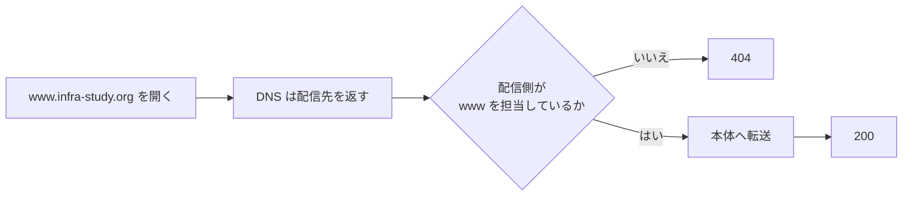

告知の投稿にサイトへのリンクを貼ると、ブラウザのセキュリティ拡張が「このサイトは安全かどうか不明です」と出していました。
1か月前の投稿を開いても同じです。時間が経てば評価が付くものだと思い、そのまま待っていました。

拡張の詳細画面を開くと、文面は「危険です」ではなく、**「このサイトはまだスキャンされていません」**でした。しかも、そこに表示されていた住所は、自分が案内していた `infra-study.org` ではなく `www.infra-study.org` です。

測ってみると、本体は 200、`www` 付きは 404 でした。DNS で名前が引けることと、その名前でサイトが出ることは別です。今回は、相手が見ている住所を先に読むだけで、1か月待っても変わらなかった理由が見えました。

## この記事で分かること

- 「未評価」という警告から、実際に見られている URL を切り分ける考え方
- DNS が引けているのに 404 になるとき、配信側まで分けて見る理由
- `www` の転送を直したあと、HTTP 側も続けて測る必要がある理由

---

## 「危険」ではなく「まだ見ていない」だった

最初の読み違いは、警告を「サイトが危険だと言われている」と受け取ったことでした。
実際の文面は「まだスキャンされていません」です。危険だと判定したのではなく、判定するところまで進んでいませんでした。

ここを読み違えたままでは、証明書やページの中身を疑っても答えに近づきません。見るべきなのは、なぜ評価が悪いのかではなく、**なぜ評価の入口まで届いていないのか**でした。

そして、その入口の住所は画面にそのまま書いてありました。

`www.infra-study.org`

自分が普段開いていたのは、`www` のない `infra-study.org` です。似ていますが、Web の配信先から見れば別の名前です。

---

## 本体は 200、www 付きは 404

2つを分けて測ると、差はすぐに出ました。

```bash
curl -sS -o /dev/null -w '%{http_code}\n' https://infra-study.org/
curl -sS -o /dev/null -w '%{http_code}\n' https://www.infra-study.org/
```

```text
200
404
```

評価する側は、ずっと 404 のページを見に来ていました。中身がないので、待っていてもスキャンは始まりません。

これはセキュリティ拡張だけの話でもありません。名刺や口頭で聞いたドメインに、自然に `www` を付けて開く人もいます。その人たちにも同じ 404 が出ていました。

*「待つ長さではなく、見に来ている場所が違ったのか」*

1か月という数字は、作業時間の記録として置いているのではありません。「時間が解決する」という見込みが外れていたことを示す数字です。1日待っても1か月待っても、入口が 404 のままなら結果は変わりません。

---

## DNS は正しく引けていた

`www` が 404 なら、DNS レコードがないのではないか。最初に考えやすい原因です。

でも、名前は正しく引けていました。存在しないはずの `zzz-does-not-exist.…` という名前まで同じ場所に解決したため、個別の `www` レコードが働いているのではなく、**すべてを受ける包括的な名前に拾われている**と分かりました。

DNS は「この名前をどこへ送るか」までは案内できます。その先の配信側が「自分は `www.infra-study.org` を担当する」と知らなければ、サイトの中身は返せません。



つまり、DNS の応答だけを見て「名前はあるから大丈夫」とは言えないという話です。ブラウザや `curl` で、その名前を付けた HTTP リクエストの終点まで見る必要があります。

:::message
包括的な DNS の応答は、「その名前用のサイトがある」という証拠にはなりません。名前解決と Web 配信は分けて見ます。
:::

---

## www を本体へ送る道を明示した

入れたものは2つです。

- `www` で来たリクエストを本体へ転送する規則
- `www` という名前を明示する専用レコード

専用レコードの行き先には、どの機器にも割り当てられない予約済みのアドレスを置きました。そこへ通信を届けたいわけではありません。手前の転送規則がリクエストを受け、本体へ返すための入口としてレコードを置いています。

DNS の行き先だけを見ると、少し変わった形です。ただ、今回の役割はサーバーへ直接つなぐことではなく、`www` という名前を転送規則まで運ぶことでした。

:::message alert
ここで使う予約済みアドレスは、実在する機器のアドレスではありません。自宅や社内の機器へ向ける話ではなく、転送専用の名前を明示するためのものです。
:::

---

## 直した直後、HTTP だけ 522 になった

`www` の転送を入れた直後、暗号化ありの入口は狙いどおり本体へ進みました。ところが、暗号化なしの入口だけは 522 です。

転送規則が暗号化ありの入口しか見ていなかったためでした。ゾーン全体で受ける設定を1つ入れると、暗号化なしの入口も本体まで進むようになりました。

ここで「転送を入れたせいで壊した」とは考えませんでした。同じ入力は、直す前には 404 だったからです。522 は新しく見えるようになった次の詰まりで、元から通っていた道を壊したわけではありません。

**設定前の同じ入力は 404 でした。壊したのではなく、元からつながっていなかった。**

この区別は地味ですが、切り戻すか、その先を直すかの判断が変わります。

---

## 直したら、隣の入口も測る

最後は HTTPS だけで終わらせず、HTTP も同じように測りました。

```bash
curl -LsS -o /dev/null \
  -w 'status=%{http_code} redirects=%{num_redirects}\n' \
  'https://www.infra-study.org/curriculum?ref=test'

curl -LsS -o /dev/null \
  -w 'status=%{http_code} redirects=%{num_redirects}\n' \
  'http://www.infra-study.org/curriculum?ref=test'
```

```text
status=200 redirects=1
status=200 redirects=2
```

直す前は HTTPS も HTTP も 404。直したあとは HTTPS が1段、HTTP が2段の転送を経て 200 になりました。元の階層とクエリも消えずに残っています。

HTTP 側が1段多いこと自体は、暗号化ありの入口へ寄せてから本体へ送る流れなら不自然ではありません。見るべきなのは段数をそろえることではなく、最終的に 200 へ着き、渡した階層とクエリが保たれていることでした。

:::details 実測結果だけを並べる
```text
直す前
  https://www.infra-study.org/curriculum?ref=test  404
  http://www.infra-study.org/curriculum?ref=test   404

転送規則と専用レコードを入れた直後
  https://www.infra-study.org/curriculum?ref=test  200
  http://www.infra-study.org/curriculum?ref=test   522

ゾーン全体で受ける設定を入れた後
  https://www.infra-study.org/curriculum?ref=test  200（転送 1 段）
  http://www.infra-study.org/curriculum?ref=test   200（転送 2 段）
  階層とクエリは保持
```
:::

---

## この記事で扱わない範囲

この記事は、特定のセキュリティ拡張の評価基準や、Cloudflare の画面を順番にたどる手順書ではありません。画面の名前は変わる可能性があり、今回の山場でもなかったためです。

扱っているのは、警告に出た URL を読み、DNS の応答と Web の応答を分け、転送を入れたあとに HTTPS と HTTP の両方を測るところまでです。

DNS が引けるのに 404 なら、DNS だけで調査を終えません。**その名前を配信側が担当しているか**まで見ます。

---

## 待つ前に、相手が見ている住所を読む

「そのうち評価される」と考える前に、相手がどの住所を見に来ているのかを読むべきでした。今回は、その答えが警告の詳細画面に出ていました。
警告も「危険」ではなく「まだスキャンしていない」です。言葉を正確に読めば、危険への対策ではなく、評価の入口へ届かない理由を探せます。

名前は、包括的な DNS に拾われただけでは Web の入口になりません。`www` を明示し、配信側にも担当する名前だと伝えて、初めて中身が返ります。

そして1つの入口を直したら、隣の入口も測る。HTTPS が 200 になったあとに HTTP の 522 が見えたことで、残っていた道の切れ目も直せました。

**名前が引けることと、その名前でページが出ることは別です。**

---

## ご紹介

自分は、自宅に物理サーバーを置いて、インフラを学べる場所を作っています。

教材は登録なしで無料で読めます。実機のサーバーに接続する演習は構築中で、まだ全章には対応していません。

**全章インデックス:** [infra-study.org/curriculum](https://infra-study.org/curriculum)

**感想フォーム:** [感想フォーム（Tally）](https://tally.so/r/eqvX8l)

---

X（@taro3_01）で更新を告知しています。フォローすると次回の通知が届きます。

@[card](https://x.com/taro3_01)
